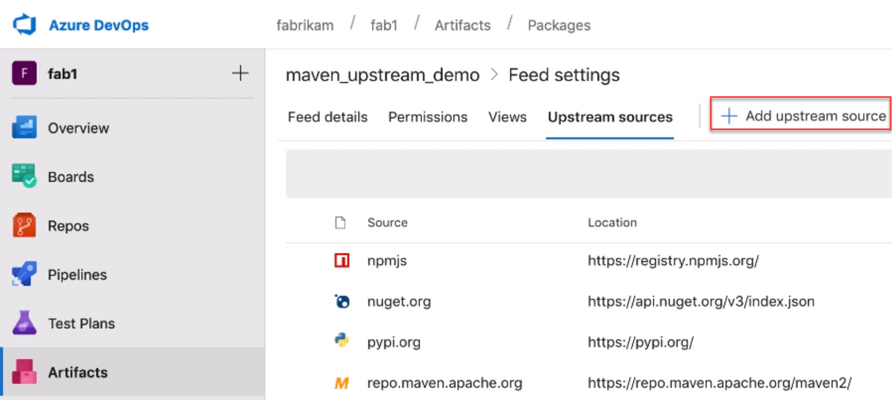

### Upstream sources for Maven

Upstream sources are now available for Maven feeds. This includes the primary Maven Central repository and Azure Artifacts feeds. To add Maven upstreams to an existing feed, visit **Feed settings**, select the **Upstream sources pivot**, then select **Add upstream source**.

> [!div class="mx-imgBorder"]

