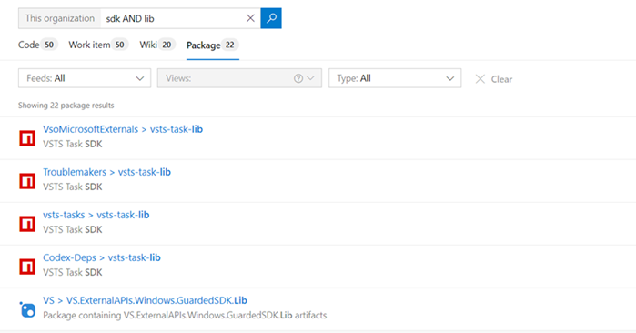
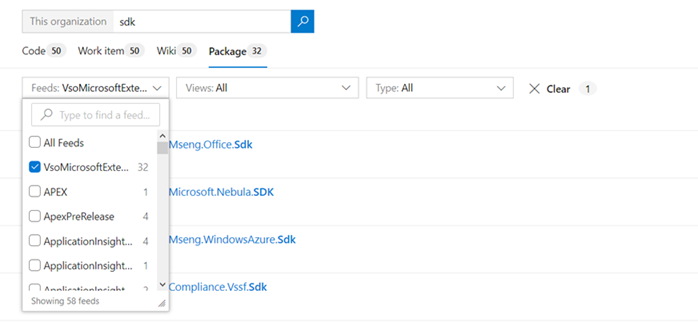

### Filtered downloads for Universal Packages

Until now, you've always had to download an entire Universal Package, even if you only needed a few files from it. With this update, you can specify a minimatch pattern (using the same syntax as Azure Pipelines) to download a subset of files. For example:

`az artifacts universal download --organization "https://dev.azure.com/myorganization/" --feed "myFeed" --name "myPackageName" --version 1.0.0 --path .  --file-filter "**/*.exe;**/*.dll"`

To use this feature, make sure you've updated to the latest Azure DevOps CLI extension: **az extension update -n azure-devops**

### Package Search

Introducing organization level package search that provides fast, flexible, and accurate search across all the packages in various feeds of an organization. As the number of packages grow in your organization and are divided across multiple feeds, finding the package that you need becomes increasingly difficult. Package search can quickly and efficiently locate relevant packages across all your organization feeds.

By using package search, you can:
* **Search package by title and description:** You can quickly and easily find relevant packages by using free text search on title and description. You can also narrow your search by using Boolean operators and combine search criteria. 

> [!div class="mx-imgBorder"]
> 

* **Search across all your organization feeds:** Search in your and your team's feeds across the organization. Narrow your search by using feed, view, and package type filters. Use wildcards to widen your search and Boolean operators to fine-tune it. 

> [!div class="mx-imgBorder"]
> 

You can learn more about package search [here](https://docs.microsoft.com/azure/devops/project/search/package-search?view=azure-devops).
