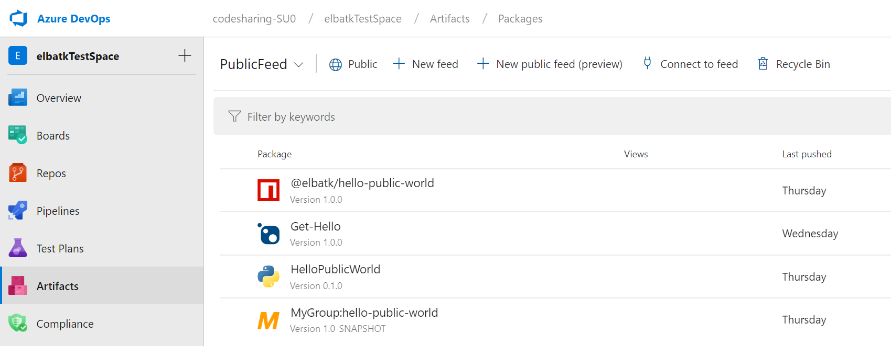

### Share your packages publicly with public feeds (preview)

You can now create and store your packages inside public feeds. Packages stored within public feeds are available to everyone on the internet without authentication, whether or not they're in your organization, or even logged into an Azure DevOps organization. Learn more about public feeds in our [feeds documentation](https://docs.microsoft.com/azure/devops/artifacts/concepts/feeds) or jump right into our [tutorial for sharing packages publicly](https://docs.microsoft.com/azure/devops/artifacts/tutorials/share-packages-publicly).

> [!div class="mx-imgBorder"]
> 
