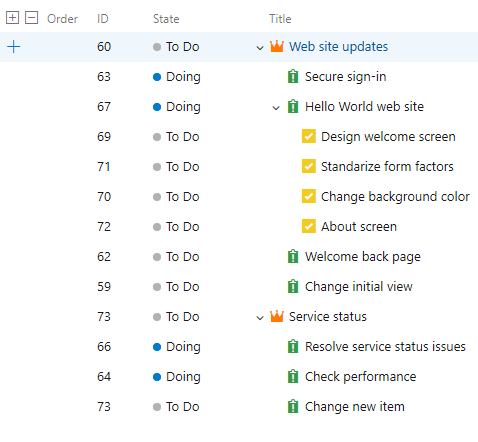

### Simplify the organization of your work using the Basic process

> [!IMPORTANT]  
> The Basic process is in public preview as the default process for new projects within new organizations created in the Central US region.

Historically, Agile has been the default process for new projects, offering a robust and flexible set of work item types and states to suit a variety of project delivery methods. For some teams, who are more familiar with other tools or who are growing and want to adopt a more powerful tool set, want to get started quickly using terminology they are more familiar with.

The new Basic process provides three work item types (Epics, Issues, and Tasks) to plan and track your work. We recommend that you use Issues to track things like user stories, bugs, and features while using Epics to group Issues together into larger units of work. As you make progress on your work, move items along a simple state workflow of To Do, Doing, and Done.

> [!div class="mx-imgBorder"]
> 

See the [track issues and tasks](https://docs.microsoft.com/en-us/azure/devops/boards/get-started/track-issues-tasks?view=azure-devops) documentation to help you get started with your new project.

