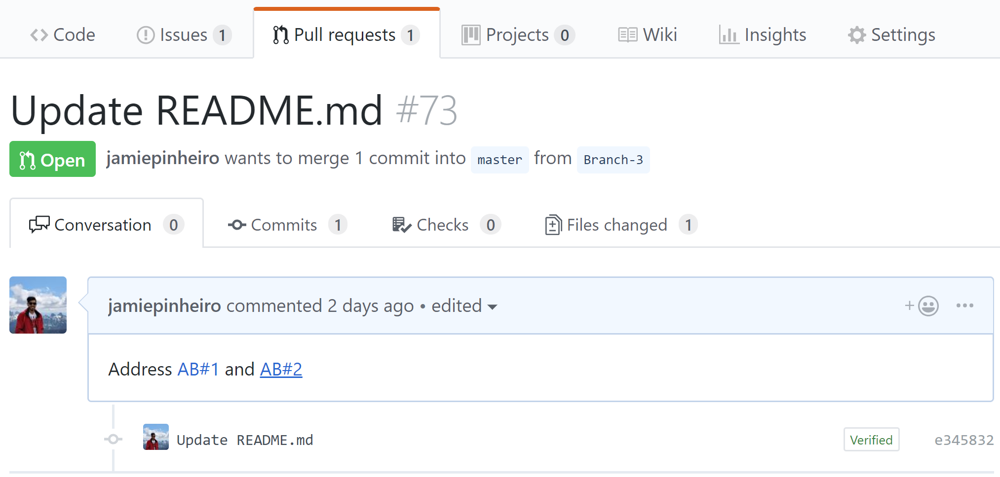

### Navigate to Azure Boards work items directly from GitHub pull request mentions

In December [we released](/azure/devops/release-notes/2018/sprint-144-update#link-github-commits-and-pull-requests-to-azure-boards-work-items) the beginning of our integration between Azure Boards and GitHub. One way to establish links using this integration is to mention a work item within the description of a pull request using the `AB#{work item ID}` syntax.
Now, those mentions will become hyperlinks that you or others in your project can click to navigate directly to the mentioned work item.

> [!div class="mx-imgBorder"]
> 