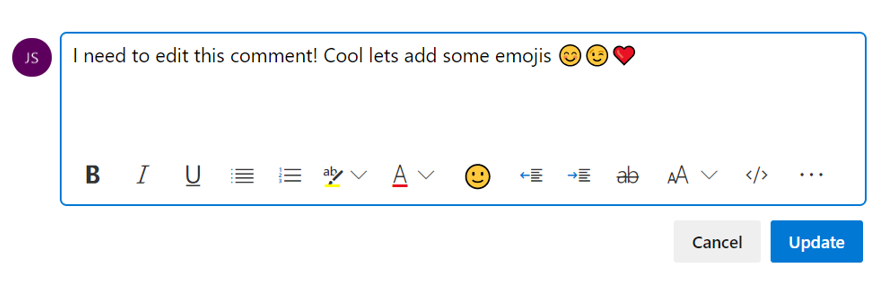
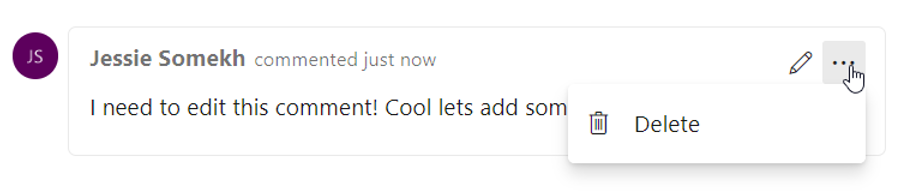
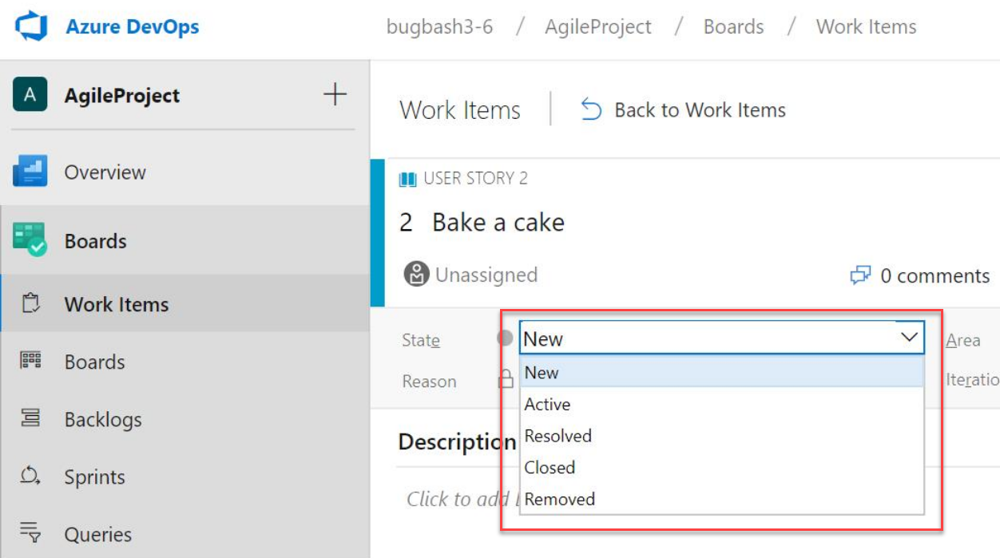

### Navigate to Azure Boards work items directly from mentions in any GitHub comment

Now when you mention a work item within the comment of an issue, pull request, or commit in GitHub using the `AB#{work item ID}` syntax, those mentions will become hyperlinks that you can click on to navigate directly to the mentioned work item.

This doesn't create a formal link that clutters up the work item in Azure Boards for every related conversation, but instead gives your team a way to provide a little more information about work items while discussing code or a customer-reported issue. See the [Azure Boards GitHub integration](https://aka.ms/azureboardsgithub) documentation for more information.

> [!div class="mx-imgBorder"]
> 

### Updates to work item transition rules

We cleaned up multiple work item transition rules that have been inconsistent across different processes and work item types. Closed By, Closed Date, and State Changed Date have been fixed across all standard work item types and newly customized inherited work item types. Activated By and Activated Date are fixed for all system work item types but will not be fixed for customized inherited work item types.

### Azure Boards GitHub Enterprise support

Teams can now connect Azure Boards projects to repositories hosted in GitHub Enterprise Server instances. When connecting using OAuth, follow the steps in the documentation for [Registering an OAuth application](https://docs.microsoft.com/azure/devops/boards/github/connect-to-github?view=azure-devops-2019) before creating a connection to your repositories.

### Edit and delete comments in work item

We’re excited to announce that you can now edit and delete comments in your work item's discussion in Azure Boards a highly voted feature from our [Developer Community forum](https://developercommunity.visualstudio.com/content/idea/365434/edit-comments-on-tickets-discussion.html). To edit your comment, simply hover over any comment that you own, and you wil­­l see two new buttons. If you click the pencil icon, you will enter in to edit mode and can simply make your edits and press the “Update” button to save your edits.

> [!div class="mx-imgBorder"]
> 

When you click the overflow menu, you will see the option to delete your comment. Once you click this, you will be prompted again to confirm that you want to delete this comment, and the comment will be deleted.

> [!div class="mx-imgBorder"]
> 

You will have a full audit trail of all the edited and deleted comments in the history tab on the work item form. You will also see that we’ve updated the UI of our discussion experience to make it feel more modern and interactive. In addition, we added bubbles around comments to make it clearer where individuals comments start and end.

### State value order on work item form

Previously, the state value on the work item form was ordered alphabetically. With this update we changed how the state values are ordered to match the workflow order in the process settings.

> [!div class="mx-imgBorder"]
> 
> 
> [!NOTE]
> The order change will only affect the form in the web and the REST APIs. The state value order will not be changed in clients using WIT Client OM such as Visual Studio 2017 or Excel.
