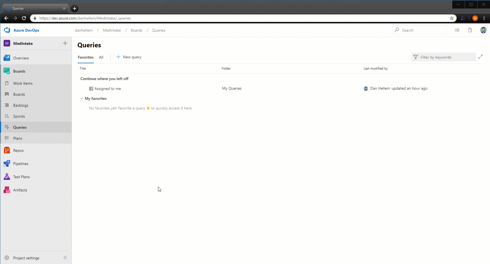

### Query work based on Azure Active Directory groups

With the increased adoption of Azure Active Directory and prevalence of using groups to manage security, teams have increasingly been looking for ways to leverage those groups in Azure Boards. Now, in addition to querying work items which have been assigned or changed by specific people using the **In Group** or **Not In Group** operators, you can also use Azure Active Directory groups directly.

See the [query operators]( https://docs.microsoft.com/azure/devops/boards/queries/query-by-workflow-changes?view=azure-devops#team-or-group-membership-queries) documentation for more information.

> [!div class="mx-imgBorder"]
> 

### Share your team’s board using a badge

The repository’s README is often the home that your project team turns to for information about how to contribute to and use your solution. Now, like you can with a build or deployment status in Azure Pipelines, you can add to your README a badge for your team’s board in Azure Boards. You can configure the badge to show only the **In Progress** columns or all columns, and even make the badge visible publicly if your project is open source.

> [!div class="mx-imgBorder"]
> 

If your README is based on Markdown you can simply copy the sample Markdown from the status badge settings page and paste it into your file.

> [!div class="mx-imgBorder"]
> 

### Query for work relative to the start of the day, week, month, or year

While teams often focus on work within the context of what’s coming up next or based on sprint iterations, it’s often interesting to look back at work through the lens of the calendar to report on all the work that happened last month or in the first quarter of the year. Now you can use the following new set of <strong>@StartOf</strong> macros along with any date-based field to query based on the start of the day, week, month or year:

* @StartOfYear
* @StartOfMonth
* @StartOfWeek
* @StartOfDay

Each of these macros also accepts a new modifier string that lets you shift the data by different date units. For example, you can write a query to find all work items completed in the first quarter of this year by querying on State Change Date >= @StartOfYear and State Change Date <= @StartOfYear(“+3M”). See the [query macros](https://docs.microsoft.com/azure/devops/boards/queries/query-operators-variables?view=azure-devops#query-macros-or-variables) documentation for more information.

> [!div class="mx-imgBorder"]
> 

### Export query results to a CSV file

You can now export query results directly to a CSV format file from the web.

> [!div class="mx-imgBorder"]
> 
