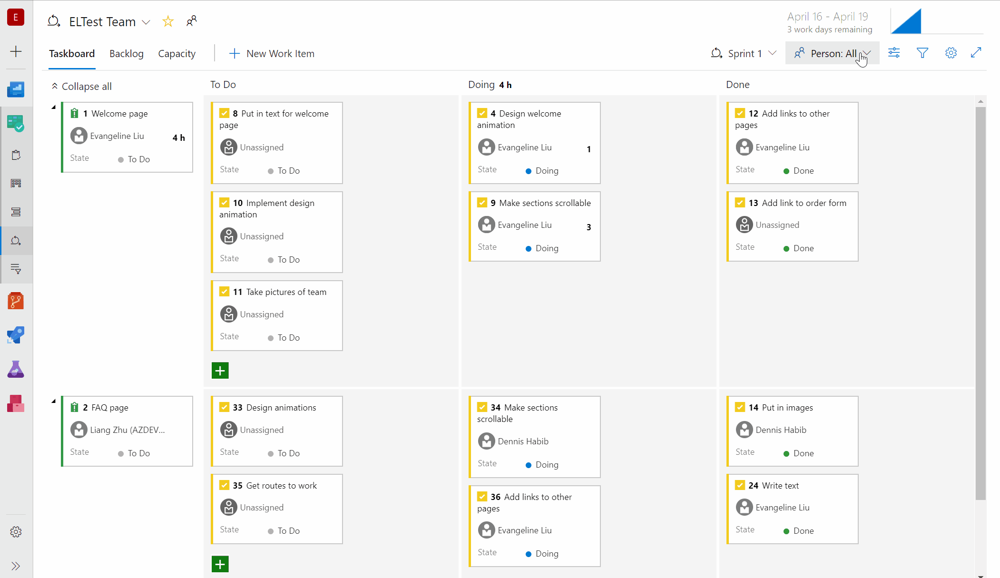

### Add Azure Boards from the GitHub Marketplace

The new **Azure Boards** app in the [GitHub Marketplace](https://aka.ms/azureboardsgithub/install) streamlines the acquisition and configuration of Azure Boards for your GitHub repositories. 

Previously, you could enable a connection with GitHub repositories through OAuth or personal access token authentication. Using OAuth or PAT, Azure Boards uses **an individual's GitHub identity** to monitor and link code activity with work items. However, since the members of your team may change over time, it can be less desirable to use an individual's GitHub identity and permissions. By installing the Azure Boards app, you can authorize **the app** to perform actions instead. 

To get started, install the app from the [GitHub Marketplace](https://aka.ms/azureboardsgithub/install) in your GitHub account or organization. You can also see the [GitHub & Azure Boards](https://docs.microsoft.com/azure/devops/boards/github/?view=azure-devops) documentation for more information.

> [!div class="mx-imgBorder"]
> 

### Accept and execute on issues in GitHub while planning in Azure Boards

The integration between Azure Boards and GitHub thus far has been all about linking code activity to work items. While this has been suitable for several teams that want to fully leverage Azure Boards for planning and work management, it's left other teams, who may still want to track issues in GitHub, wanting more. 

Now you can link work items in Azure Boards with related issues in GitHub. With this new type of linking, several other scenarios are now possible. If your team wants to continue accepting bug reports from users, for example, as issues within GitHub but relate and organize the team's work overall in Azure Boards, now you can.

> [!div class="mx-imgBorder"]
> 

The same mention syntax your team uses for commits and pull requests still applies and of course you can link manually in Azure Boards with the issue URL. See the [GitHub & Azure Boards](/azure/devops/boards/github/) documentation for more information.

> [!div class="mx-imgBorder"]
> 

### Taskboard people switcher

Depending on the size of your team and the number of work items in progress, your taskboard can get a bit crowded. You can use filtering to choose which cards to display and focus on what's of interest in the moment. 

Now you can choose how you filter a person on the taskboard.  Use the person switcher when you need to see how the selected person's work relates to the team's work. This will highlight cards belonging to the person selected so you can view, update, and reorder any cards while focusing on the selected person.

> [!div class="mx-imgBorder"]
> 

The filter bar now works in parity with the filtering experiences so you only see the cards that match the filter. Use the **Assigned to** filter when you need to quickly find what you and others are working on.

> [!div class="mx-imgBorder"]
> 
