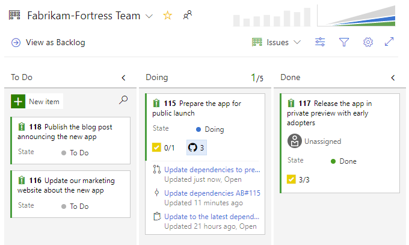
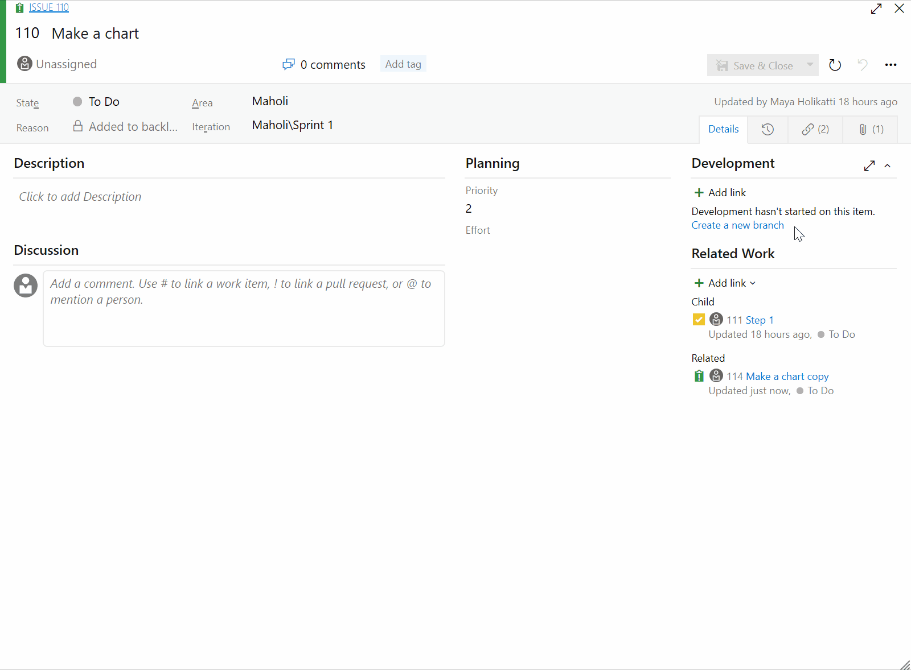
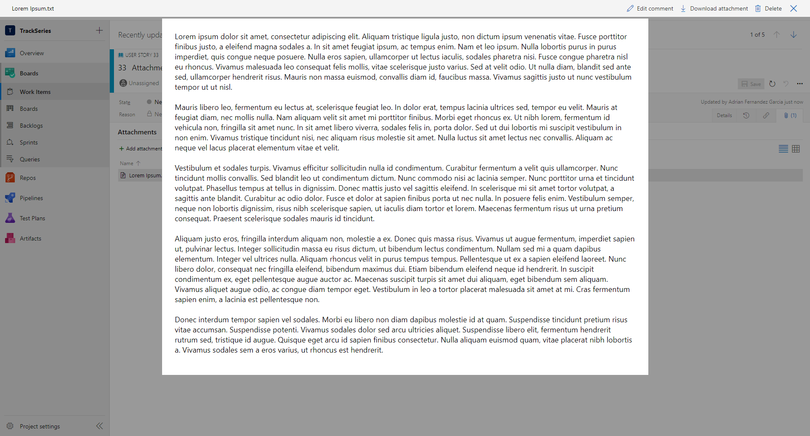
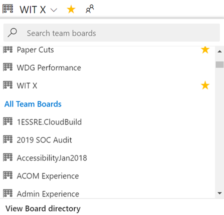

### Quickly view linked GitHub activity from the Kanban board

When reviewing the Kanban board yourself or as a team, you often have questions such as "has this item started development yet?" or "is this item in review yet?" With the new GitHub annotations on the Kanban board, now you can get a quick sense of where an item is and directly navigate to the GitHub commit, pull request, or issue for more detail. See the [Customize cards](/azure/devops/boards/boards/customize-cards?view=azure-devops#enable-annotations-kanban-boards) documentation for more information about this and the other annotations for Tasks and Tests.

> [!div class="mx-imgBorder"]
> 

### Copy work items with attachments and links

Sometimes you may need to create a copy of a work item and include minor changes to the new work item. Previously, you could only copy the work item’s content and links. Now, you can copy attachments as well. 

To copy a work item with attachments, select copy work item from the ellipsis and then select attachments.

> [!div class="mx-imgBorder"]
> 

### Preview text files on work item

Often, .txt and .log files are attached to work items for light notes or documentation of events. You can now preview those text attachments on the work item, so you don't need download them to see their contents.

> [!div class="mx-imgBorder"]
> 

### See all teams in Boards, Backlogs, and Sprints pickers

When navigating between teams, you may want to search for a team that you don't have in your favorites. Previously, you had to navigate to a directory page to search for the team. Now, you can search for any team in the project from the picker on Boards, Backlogs, or Sprints without interrupting your workflow.

> [!div class="mx-imgBorder"]
> 