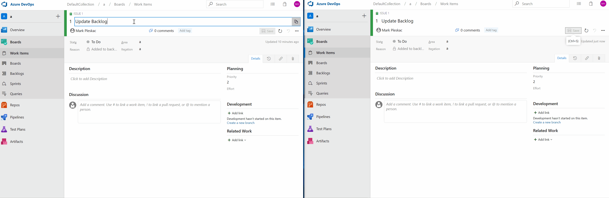
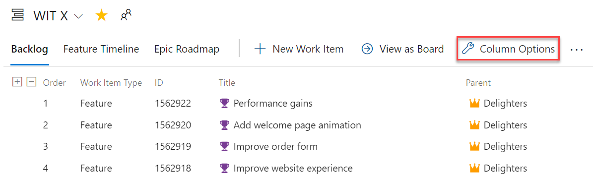
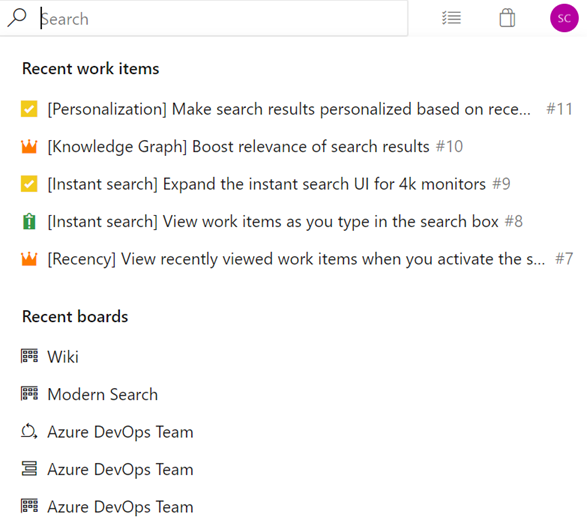
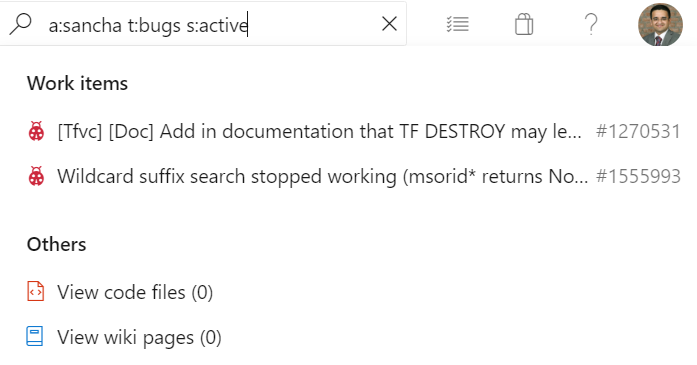
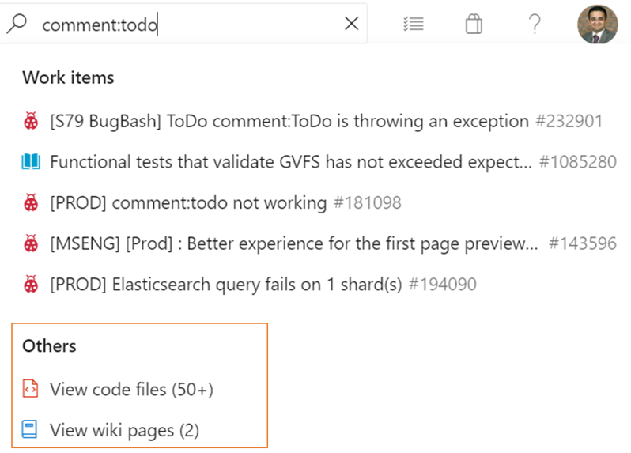

### Work item live reload

Previously, when updating a work item, and a second team member was making changes to the same work item, the second user would lose their changes. Now, as long as you are both editing different fields, you will see live updates of the changes made to the work item.  

> [!div class="mx-imgBorder"]
> 

### Manage iteration and area paths from the command line

You can now manage iteration and area paths from the command line by using the `az boards iteration` and `az boards area` commands. For example, you can setup and manage iteration and area paths interactively from the CLI, or automate the entire setup using a script. For more details about the commands and the syntax, see the documentation [here](https://docs.microsoft.com/cli/azure/ext/azure-devops/boards?view=azure-cli-latest).

### Work item parent column as column option

You now have the option to see the parent of every work item in your product backlog or sprint backlog. To enable this feature, go to **Column Options** on the desired backlog, then add the **Parent** column.

> [!div class="mx-imgBorder"]
> 

### Instant search for work items

We've made it easy for you to find recently visited work items, boards, backlogs and sprints. You can now access recently visited work items by clicking on the search box in Azure Boards. 

> [!TIP]
> You can invoke the search box by typing the keyboard shortcut "/".   

> [!div class="mx-imgBorder"]
> 

### Search for a work item as you type

Now you can view the work item search results as you type in the search box. This will help you quickly navigate to the work item of your choice.

> [!div class="mx-imgBorder"]
> 

In addition, you can navigate to code and wiki search results without having to switch tabs by landing on work items search and then changing tabs to view code wiki or package search results.

> [!div class="mx-imgBorder"]
> 