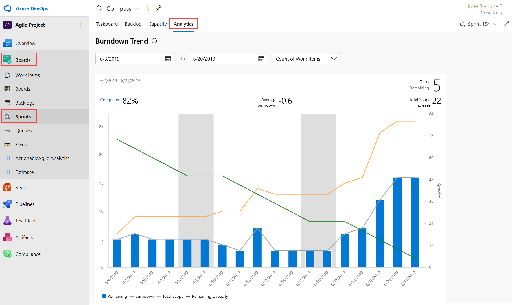
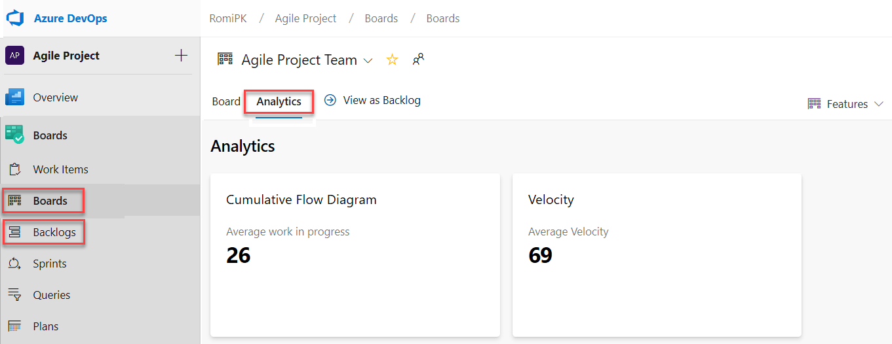
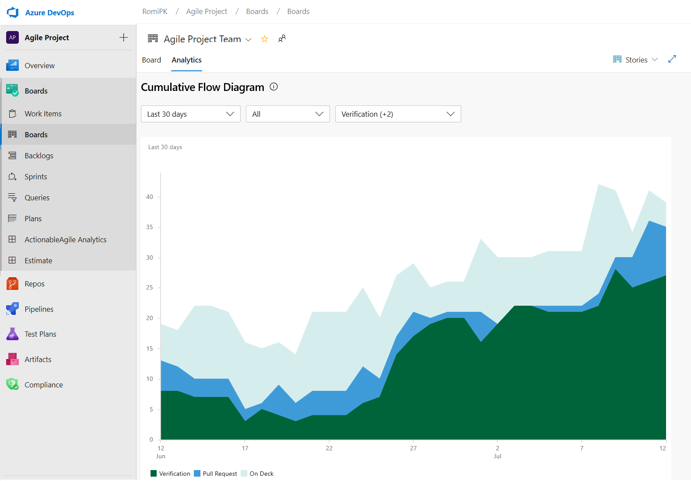
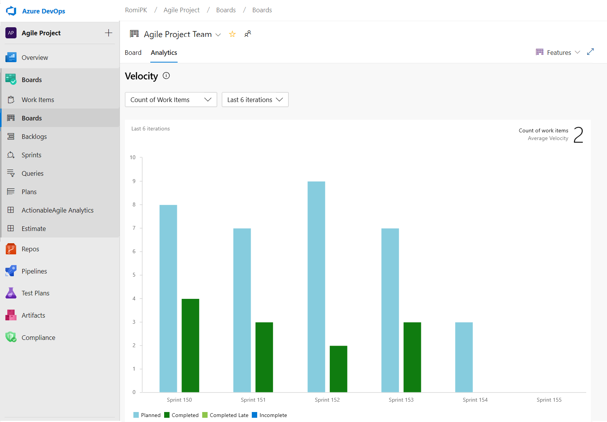
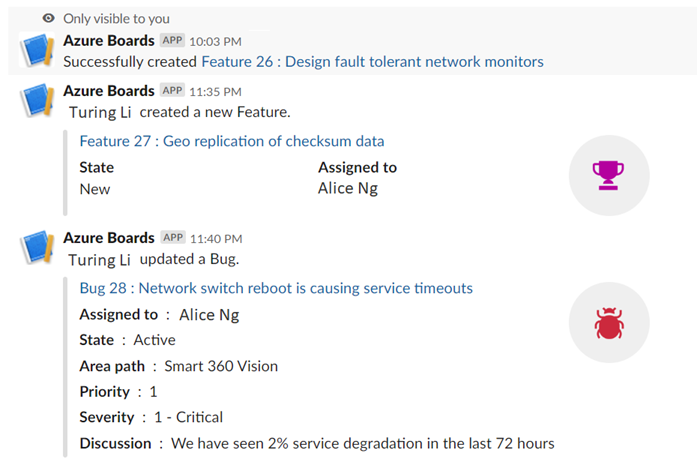
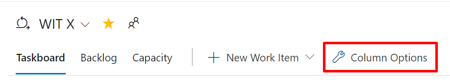
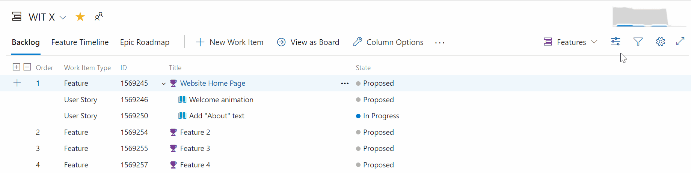
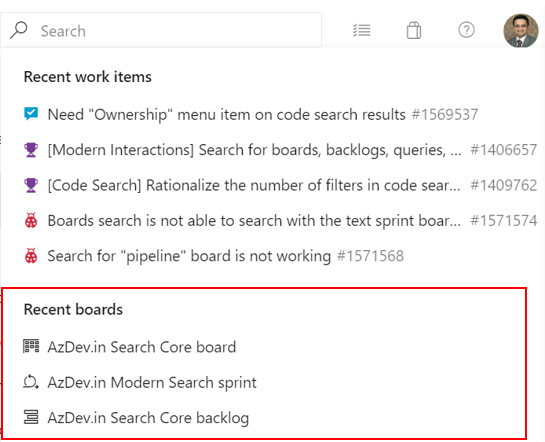
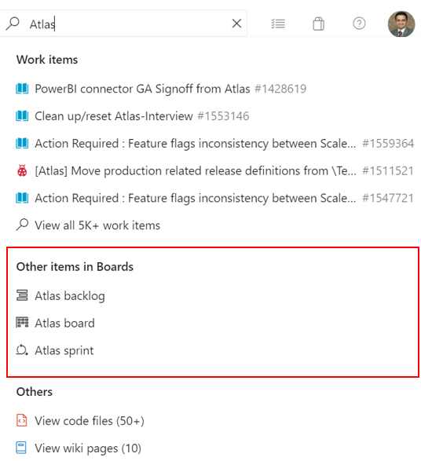

### Get insights into your team’s health with three new Azure Boards reports

You can’t fix what you can’t see. Therefore, you want to keep a close eye on the state and health of their work processes. With these reports, we are making it easier for you to track important metrics with minimal effort in Azure Boards. 

The three new interactive reports are: **Burndown**, **Cumulative Flow Diagram** (CFD) and **Velocity**. You can see the reports in the new analytics tab. 

Metrics like sprint burndown, flow of work and team velocity give you the visibility into your team's progress and help answer questions such as: 
* How much work do we have left in this sprint? Are we on track to complete it?
* What step of the development process is taking the longest? Can we do something about it?
* Based on previous iterations, how much work should we plan for next the sprint?

> [!NOTE]
> The charts previously shown in the headers have been replaced with these enhanced reports.

The new reports are fully interactive and allow you to adjust them for your needs. You can find the new reports under the **Analytics tab** in each hub. 

* The burndown chart can be found under the **Sprints** hub.

    > [!div class="mx-imgBorder"]
    > 

* The CFD and Velocity reports can be accessed from the **Analytics tab** under **Boards** and **Backlogs** by clicking on the relevant card.

    > [!div class="mx-imgBorder"]
    > 

With the new reports you have more control and information about your team. Here are some examples:

* The Sprint Burndown and the Velocity reports can be set to use count of work items or sum of remaining work.
* You can adjust the timeframe of the sprint burndown without affecting the project dates. So, if your team usually spends the first day of each sprint planning, you can now match the chart to reflect that. 
* The Burndown chart now has a watermark showing weekends.
* The CFD report lets you remove board columns like Design to gain more focus on the flow the teams have control on.

Here is an example of the CFD report showing the flow for the last 30 days of the Stories backlog.

  > [!div class="mx-imgBorder"]
  > 

The Velocity chart can now be tracked for all backlog levels. For example, you can now add both Features and Epics whereas before the previous chart supported only Requirements. Here is an example of a velocity report for the last 6 iterations of the Features backlog.

  > [!div class="mx-imgBorder"]
  > 

### Azure Boards app for Slack

We're happy to announce the new Azure Boards app for Slack. With this app you can monitor work item activity and create work items from your Slack channel. 

The app allows you to set up and manage event subscriptions including creation, and work item updates, and to get notifications for these events in your Slack channel. The conversations in the Slack channel can be used to create work items. ​ You will also get personal notifications when work items are assigned to you. In addition, previews for work item URLs will let you initiate discussions.

> [!div class="mx-imgBorder"]
> 

To install the Azure Boards app, click [here](https://azchatopprodcus1.azchatops.visualstudio.com/_slack/installboardsapp).

### Customize Taskboard columns 

We're excited to announce that we added an option to let you customize the columns on the Taskboard. You can now add, remove, rename, and reorder the columns. 

To configure the columns on your Taskboard, go to **Column Options**.

> [!div class="mx-imgBorder"]
> 

This feature was prioritized based on a [suggestion](https://developercommunity.visualstudio.com/content/idea/365416/customize-the-columns-on-the-task-board.html) from the Developer Community. 

### Toggle to show or hide completed child work items on the backlog

Many times, when refining the backlog, you only want to see items that have not been completed. Now, you have the ability to show or hide completed child items on the backlog. 

If the toggle is on, you will see all child items in a completed state. When the toggle is off, all child items in a completed state will be hidden from the backlog.

> [!div class="mx-imgBorder"]
> 

### Search for boards, backlogs, queries and sprint from the instant search box

Now you can easily access your recently visited boards, backlogs, queries and sprints from the search box by activating the search box in Azure Boards. 

> [!div class="mx-imgBorder"]
> 

In addition, you can search for the boards, backlogs, queries and sprints across your project by typing the board name in the search box. Now, the boards that matter most to you are just a click away.

> [!div class="mx-imgBorder"]
> 

### Most recent tags displayed when tagging a work item

When tagging a work item, the auto-complete option will now display up to five of your most recently used tags. This will make it easier to add the right information to your work items.

> [!div class="mx-imgBorder"]
> 
