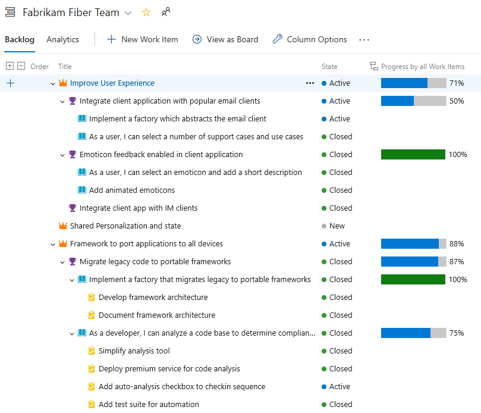

### Track the progress of parent items using Rollup on Boards backlog

Rollup columns show progress bars and/or totals of numeric fields or descendant items within a hierarchy. Descendant items correspond to all child items within the hierarchy. One or more rollup columns can be added to a product or portfolio backlog.

For example, here we show **Progress by Work Items** which displays progress bars for ascendant work items based on the percentage of descendant items that have been closed. Descendant items for Epics includes all child Features and their child or grand child work items. Descendant items for Features includes all child User Stories and their child work items.

> [!div class="mx-imgBorder"]
> 

### Taskboard live updates

Your taskboard now automatically refreshes when changes occur! As other team members move or reorder cards on the taskboard, your board will automatically update with these changes. You no longer have to press F5 to see the latest changes.