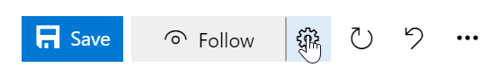
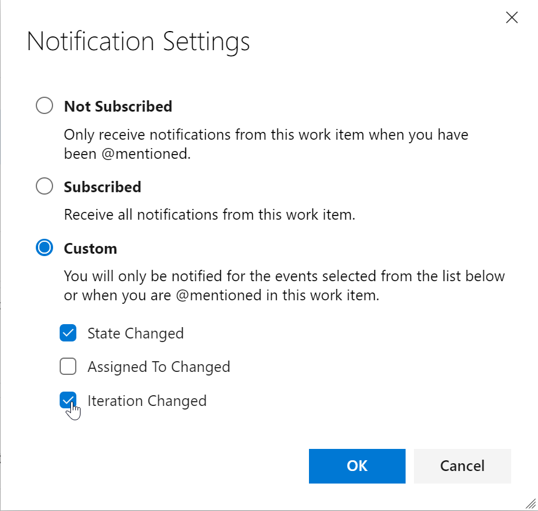
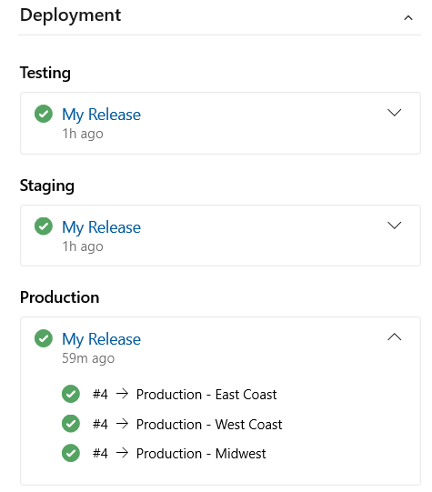

### New rule to hide fields in a work item form based on condition 

We've added a new rule to the inherited rules engine to let you hide fields in a work item form. This rule will hide fields based on the users group membership. For example, if the user belongs to the "product owner" group, then hide a developer specific field. For more details see the documentation [here](https://docs.microsoft.com/en-us/azure/devops/organizations/settings/work/custom-rules?view=azure-devops).

### Custom work item notification settings

Staying up to date on work items relevant to you or your team is incredibly important. It helps teams collaborate and stay on track with projects and makes sure all the right parties are involved. However, different stakeholders have different levels of investment in different efforts, and we believe that should be reflected in your ability to follow the status of a work item. 

Previously, if you wanted to follow a work item and get notifications on any changes made, you would get email notifications for any and all changes made to the work item. After considering your feedback, we are making following a work item more flexible for all stakeholders. Now, you will see a new settings button next to the **Follow** button on the top right corner of the work item. This will take you to a pop up that will let you configure your follow options.

> [!div class="mx-imgBorder"]
> 

From **Notification Settings**, you can choose from three notification options. First, you can be completely unsubscribed. Second, you can be fully subscribed, where you get notifications for all work item changes. Lastly, you can choose to get notified for some of the top and crucial work item change events. You can select just one, or all three options. This will let team members follow work items at a higher level and not get distracted by every single change that gets made. With this feature, we will eliminate unnecessary emails and allow you to focus on the crucial tasks at hand.

> [!div class="mx-imgBorder"]
> 

### Link work items to deployments

We are excited to release a preview of the Deployment control on the work item form. This control links your work items to a release and enables you to easily track where your work item has been deployed. To learn more see the documentation [here](https://docs.microsoft.com/en-us/azure/devops/boards/work-items/work-item-deployments-control?view=azure-devops).

> [!div class="mx-imgBorder"]
> 
