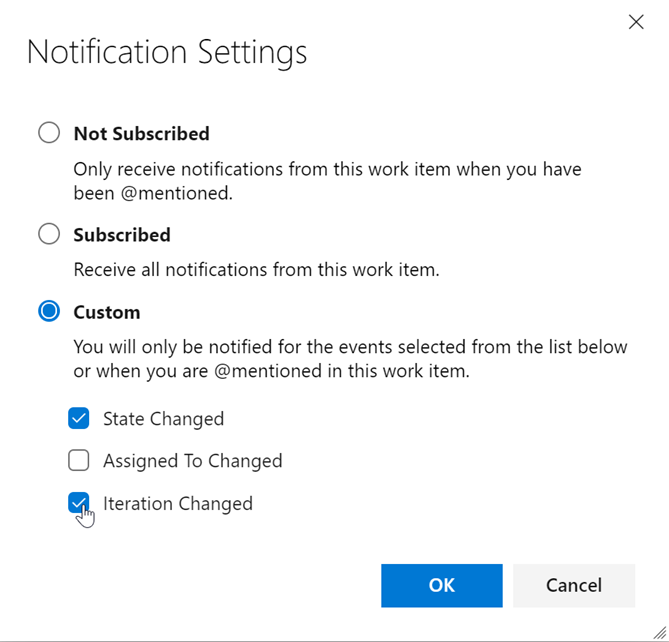

### Hide fields from the form based on condition 

We have added a new rule to the inherited rules engine for hiding fields. This rule will hide fields based on the users group membership. For example, if the user belongs to the "product owner" group, then hide a developer specific field.

### 

Staying up to date on work items relevant to you or your team is incredibly important. It helps teams collaborate and stay on on track with projects, and makes sure all the right parties are involved. However, different stakeholders have different levels of investment in different efforts, and we believe that should be reflected in one's ability to follow the status of a work item. Previously, if anyone wanted to follow a work item and get notifications on any changes made, they would get email notifications for any and all changes made to the work item. However, after considering a lot of feedback, we wanted to make follows more flexible for all different work item stakeholders. Below you can see the new experience. You will notice a new settings button next to the "Follow" button on the top right corner of the work item. This will take you to a pop up that will let you configure your follow options.

> [!div class="mx-imgBorder"]
> 

Here, you are able to choose from three notification options. First, you can be completely unsubscribed, which exists today. Second, you can be fully subscribed, where you get notifications for all work item changes. This open exists today already too. Lastly is the new "custom" option. Here, you can choose to only get notified for some of the top and crucial work item change events. You can select just one, or all three options. This will let team members follow work items at a higher level and not get distracted by every single change that gets made.

> [!div class="mx-imgBorder"]
> 

With this new feature, we will eliminate unnecessary emails and allow teams to focus on only the crucial tasks at hand!