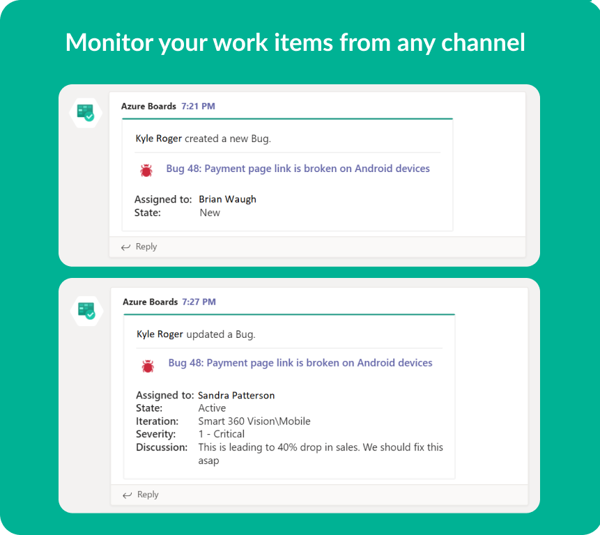
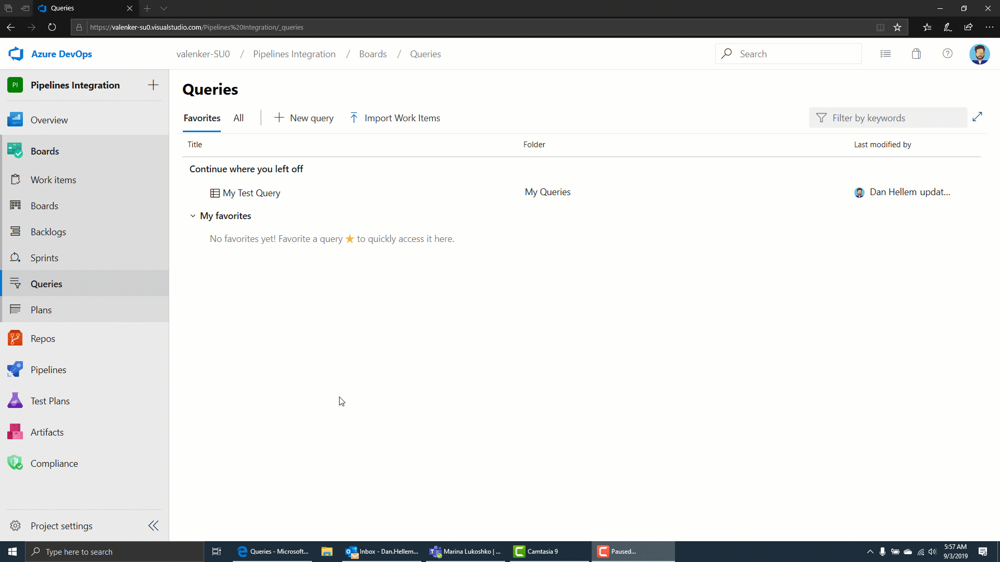
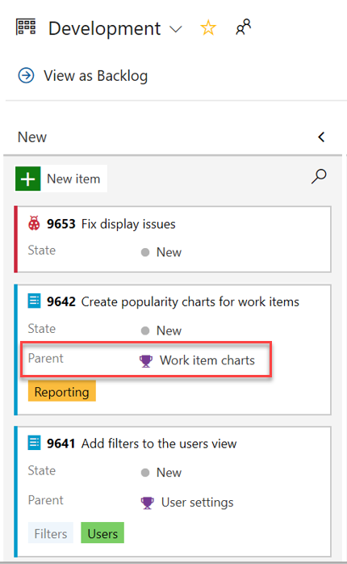
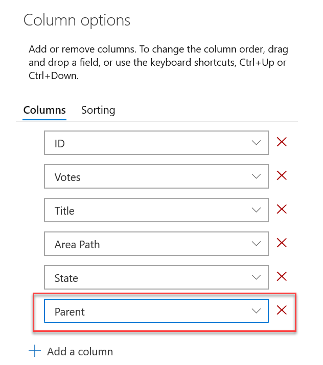
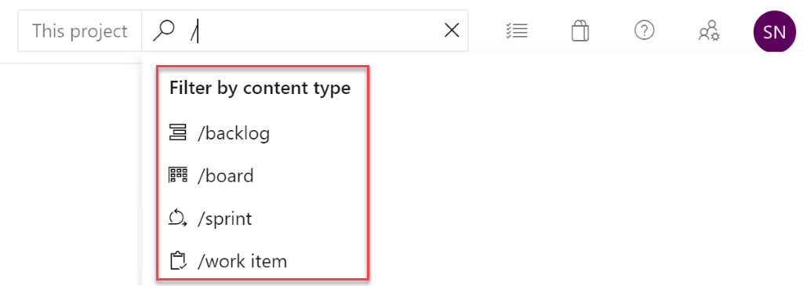
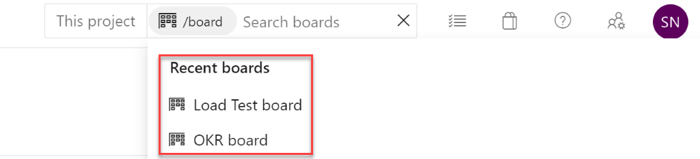

### Azure Boards app for Microsoft Teams

We're excited to announce the new Azure Boards app for Microsoft Teams. With this app you can monitor work item activity and create new work items right from within your Microsoft Teams channels. The app allows you to set up and manage event subscriptions including work item created, work item updated, etc. and to get notifications for these events in your Teams channel. The conversations in the channel can be used to create work items. In addition, you can use work items URLs to work items to get previews and initiate discussions on them.

> [!div class="mx-imgBorder"]
> 

### Import work items from a CSV file

Until now, importing work items from a CSV file was dependent on using the Excel plugin. In this update we are providing a first class import experience directly from Azure Boards so you can import new or update existing work items. To learn more, see the documentation [here](https://docs.microsoft.com/en-us/azure/devops/boards/queries/import-work-items-from-csv?view=azure-devops).

> [!div class="mx-imgBorder"]
> 

### Add parent field to work item cards

Parent context is now available within your Kanban board as a new field for work item cards. You can now add the Parent field to your cards, bypassing the need to use workarounds such as tags and prefixes.

> [!div class="mx-imgBorder"]
> 

### Add parent field to backlog and queries

The parent field is now available when viewing backlogs and query results. To add the parent field, use the **Column options**s view.

> [!div class="mx-imgBorder"]
> 

### Quick navigation in Azure Boards search

You can now set the context of your search by typing **/** and choosing from backlog, board, sprint and work item in the search box on Azure Boards. This feature makes it easier for you to search and find any item within Azure Boards without having to switch tabs for your search.  

> [!Tip] 
> You can invoke the quick navigation by typing the keyboard shortcut **/** on Azure Boards. 

> [!div class="mx-imgBorder"]
> 

For all entities on Azure Boards, this feature will filter the recently accessed items and the top results for the search term by the context and you can select a result to directly navigate to the item. 

> [!div class="mx-imgBorder"]
> 
