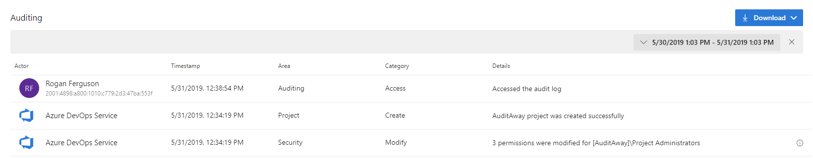

### Changes to Azure DevOps IP address ranges

We are performing a front-end routing migration that will increase availability and decrease latency. As part of this migration, our IP address space will change. If you are currently using firewall rules to allow traffic to Azure DevOps, please be sure to update these rules to account for the new IP ranges.

**IPv4 ranges**
* 13.107.6.0/24
* 13.107.9.0/24
* 13.107.42.0/24
* 13.107.43.0/24

**IPv6 ranges**
* 2620:1ec:4::/48
* 2620:1ec:a92::/48
* 2620:1ec:21::/48

For more details about this update, see the blog post with the announcement [here](https://devblogs.microsoft.com/devops/new-ip-firewall-rules-for-azure-devops/). 

### Auditing public preview

We are excited to announce that auditing for Azure DevOps is now available for all organizations as a public preview!

Auditing will log changes that occur throughout an Azure DevOps organization. When an auditable event occurs, a log entry is recorded. Some examples of audit events include: a Git repository is created, permission changes, resource deletion, code download, accessing the auditing feature, and much more. 

The audit events will have information such as IP, who caused the event to be logged, what happened, and other useful information that can help you answer who, what, when, and where questions. 

> [!NOTE]
> Audit events will be stored for 90 days. However, you can back up audit events to an external location via the auditing REST API to keep them for more than 90 days.

By default, only the project collection administrators can access the audit log. An administrator can grant separate permission to team members to access the audit logs. The auditing feature can be found under the Organizations settings.

> [!div class="mx-imgBorder"]
> 

### Manage security groups and permissions from the command line

You can now manage security groups and permissions from the command line by using the **az devops security permission** commands. By using the commands, you can create scripts to manage permissions and standardize the process of creating security groups. In addition, you can use the commands to run reports to view a list of security groups and corresponding permissions. 

For more details, see the [command and its syntax](https://docs.microsoft.com/en-us/cli/azure/ext/azure-devops/devops/security/permission?view=azure-cli-latest) and [help](https://docs.microsoft.com/azure/devops/cli/permissions?view=azure-devops) documentation.