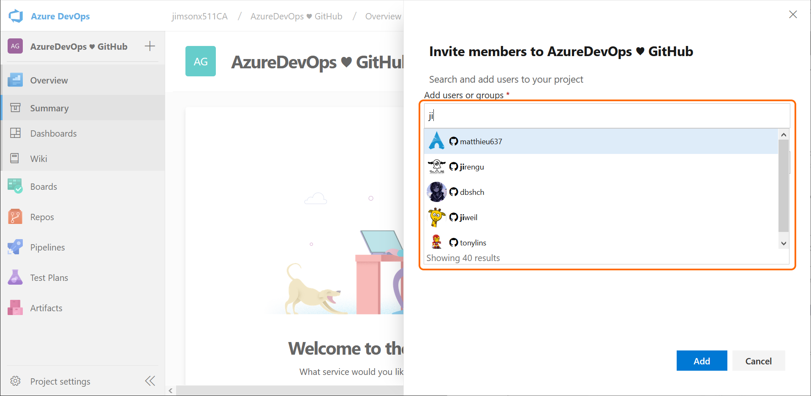
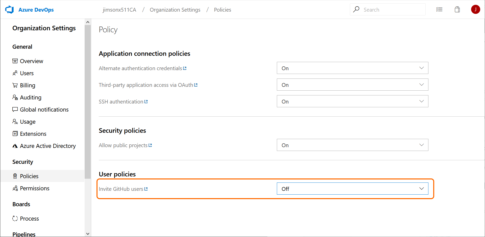

### Invite GitHub collaborators into Azure DevOps

You can now invite collaborators from GitHub to Azure DevOps when you are signed in with your GitHub identity. You can search and invite other GitHub users from the Project homepage and from the Users page in the Organization settings.

> [!div class="mx-imgBorder"]
> 

This capability must be enabled for existing organizations via a setting under **Policies** in the **Organization settings**. However, it is turned on by default for organizations created by a GitHub identity.

> [!div class="mx-imgBorder"]
> 

> [!NOTE]
> This feature is not available for non-GitHub users, even if the policy is turned on.

To learn more about inviting team members, see the documentation [here](https://docs.microsoft.com/azure/devops/user-guide/sign-up-invite-teammates?view=azure-devops#invite-team-members). If you are having issues connecting to Azure DevOps using GitHub, see the [troubleshooting authenticating & inviting GitHub users FAQs](https://docs.microsoft.com/azure/devops/organizations/security/faq-github-authentication?view=azure-devops).