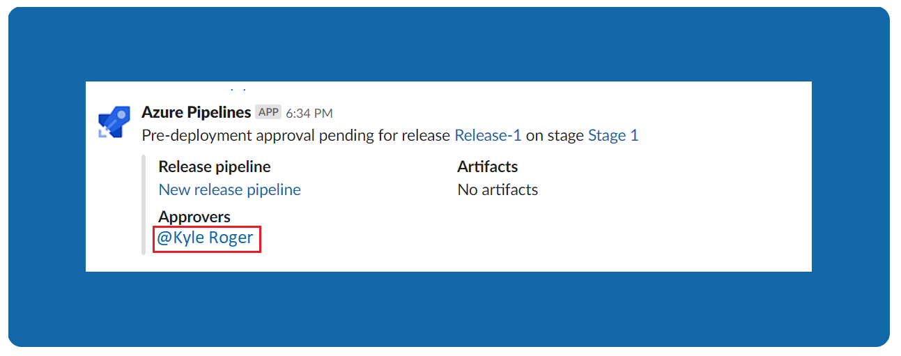
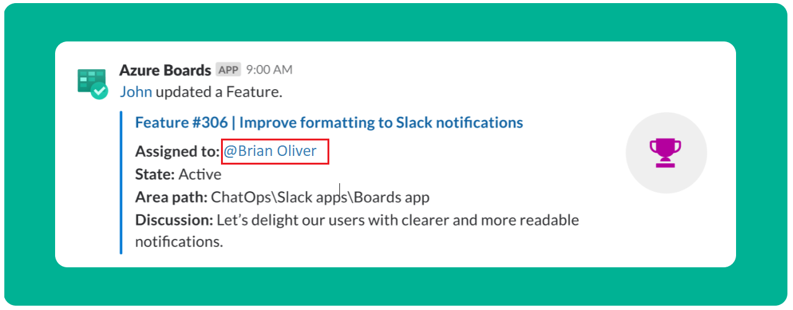
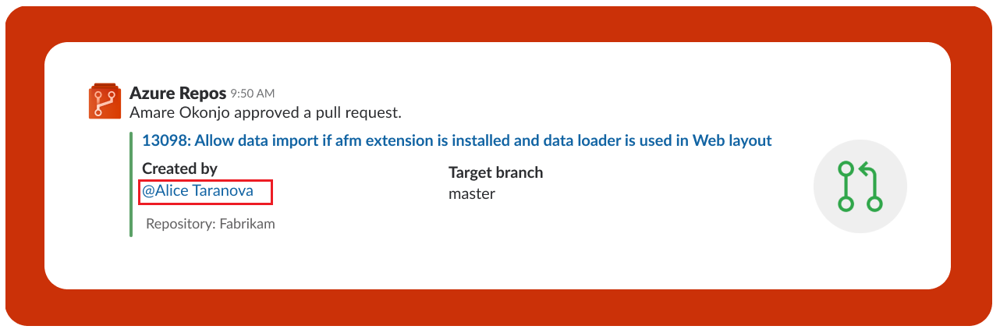
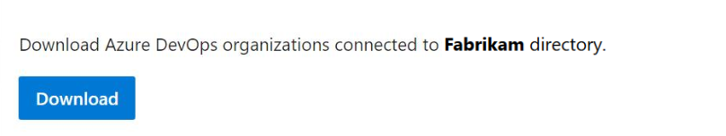

### Get personalized notifications with @mention support in Slack apps

Up to now, while using the Azure DevOps apps with Slack, customers have had to spend a considerable amount of time polling Slack channels looking for notifications requiring action. Now, the [Azure Boards app for Slack](https://aka.ms/AzureBoardsSlackIntegration), [Azure Repos app for Slack](https://aka.ms/AzureReposSlackIntegration) and [Azure Pipelines app for Slack](https://aka.ms/AzurePipelinesSlackIntegration) will use @mentions in notifications to alert users.

Here are some example scenarios where users are @mentioned:
 
* Failed builds will @mention the creator of the build
* Release deployments waiting for approval will @mention approver
* Work items assignments will @mention the new owner
* Work item state changes will @mention the owner
* Pull requests waiting for approval will @mention the approver
* Pull requests being approved or rejected will @mention the pull request creator

Kyle gets @mentioned when a release deployment is waiting for her approval

> [!div class="mx-imgBorder"]
> 

Brian gets @mentioned when a work item is assigned to him

> [!div class="mx-imgBorder"]
> 

Alice gets @mentioned when her pull request gets approved

> [!div class="mx-imgBorder"]
> 

### Download a list of organizations to a directory

You can now download the complete list of organizations backed by your Azure Active Directory tenant. This list can be retrieved from the **Azure Active Directory** tab in the Organization Settings of any organization associated with the directory. The download details will include the organization ID, Organization Name, Organization URL, and the Organization Owner.

> [!div class="mx-imgBorder"]
> 