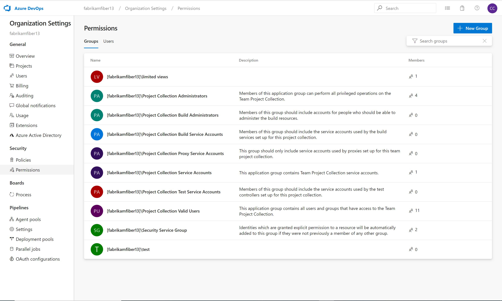

### User assignment-based billing and default access level

**User assignment-based billing**

With this update, we've added user assignment-based billing. Instead of having to increase or decrease the number of paid **Basic** or **Basic + Test Plan** licenses your organization has available to assign, now that happens automatically when you add or remove users, or change their access level. This means that you’re never paying for more licenses than you’re using, and it makes automating your access level assignment much easier. For example, you have been able to set up group rules to control what access level is assigned to new users that join your team automatically. However, in the past, these only worked if you had extra licenses you were paying for that weren’t assigned to anyone yet, and if you ran out, the [group rule](https://docs.microsoft.com/en-us/azure/devops/organizations/accounts/assign-access-levels-and-extensions-by-group-membership?view=azure-devops) failed. Those type of errors no longer happen, as long as the Azure subscription you use for billing stays active. 

**Default access level for new users**

We’ve also added a new setting that lets you choose whether you want new users added to your organization to get full Basic access or limited/free Stakeholder access. In the past, new users got Basic if there were unassigned Basic licenses available, but Stakeholder if there weren’t. All organizations will start with their default access level set to Stakeholder, so there won’t be any unexpected charges for new users. If your organization typically kept extra unassigned licenses, so new users added to projects got full Basic access, make sure to [change your default access level to Basic](https://go.microsoft.com/fwlink/?linkid=2093704&clcid=0x409). 

**Daily billing**

As part of the change to assignment-based billing, we've also switched from monthly to daily billing. Now, if you give a user paid access for a few weeks or even a few days, you pay only for the time they were assigned the paid access, rather than a full month. As we switch your organization from monthly to daily billing, your next Azure bill will likely be lower than it has been previously. The next month will be back to normal once it has a full month of accumulated daily charges.

### New UI to manage organization and project permissions

Organization and project permissions management have a new look and performance has been improved. Now, new group members will appear in the list as they are added without requiring a forced page refresh. Head over to your **Organizations Settings** and take a look.

> [!div class="mx-imgBorder"]
> 