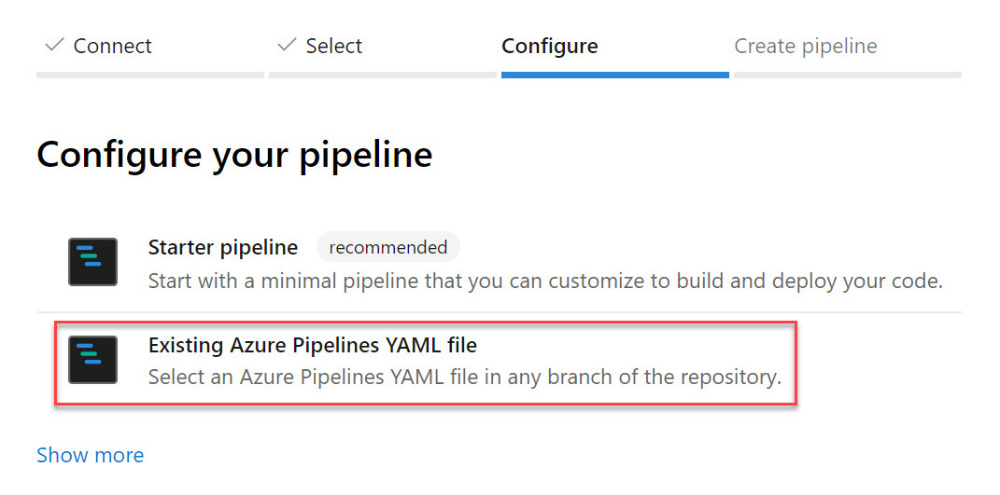

### Restore deleted release pipelines

Deleting unused release pipelines helps to keep the release pipeline list clean but sometimes you delete something by mistake. With this update, it's now possible to restore a release pipeline that was deleted within the last 30 days. We added a new tab to the left panel of the Releases page that will display a list of deleted release pipelines. From this view you can restore a deleted release pipeline by selecting the pipeline from the list and clicking the **Restore** button.

> [!div class="mx-imgBorder"]
> 

### YAML files for a new pipeline are committed by your identity, not our bot

While creating a pipeline, Azure Pipelines will optionally commit a YAML file to your repository and then create a pull request for the pipeline. Previously, if the repository was on GitHub and you had the [Azure Pipelines GitHub App](https://github.com/marketplace/azure-pipelines) installed, the commit and pull request appeared to be created by the GitHub App: "Azure Pipelines [bot]". With this update, we will show your GitHub identity as the creator of the pipeline instead of the GitHub App.

### Create pipelines from an existing YAML file in any branch or path

Currently, Azure Pipelines will detect and automatically use an existing YAML file named `azure-pipelines.yml` or `.azure-pipelines.yml` at the root of your repository in the default branch when creating a new pipeline. With this update, you can choose an existing Azure Pipelines YAML file with a different name or path, or in a non-default branch.

To select an existing file, from the **New build pipeline** wizard configuration page select **Existing Azure Pipelines YAML file**. Then, choose the branch and browse to select the YAML file path.

> [!div class="mx-imgBorder"]
> 

### Run pipelines using GitHub pull request comments

With this update, you can run a pipeline or test suite to validate a GitHub pull request from the comments section of that PR. Any owner or collaborator can comment on a pull request with `/AzurePipelines run` or `/AzurePipelines run <pipeline_name>` to trigger a build.

You can also abbreviate the `/AzurePipelines` moniker as `/azp`. For more details on this feature type `/azp help` in the comment.

> [!div class="mx-imgBorder"]
> 

### Limit pull request validation builds to authorized team members

It's a good practice to protect the quality of a branch by implementing [pull request validation builds](https://docs.microsoft.com/azure/devops/pipelines/build/triggers?view=azdevops#pull-request-validation). Until now, those validation builds were triggered automatically by any GitHub pull request, which could be risky since the build would start without your review.

With this update, you can require pull request validation builds to be authorized by your team. To do so, select the Triggers tab in your pipeline's settings. Then, under Pull request validation, enable **Only trigger builds for collaborators' pull request comments** and save the pipeline.

Now, pull request validation builds will not be triggered automatically. Any repository owner or contributor can trigger a validation build by commenting on the pull request with `/AzurePipelines run` or `/AzurePipelines run <pipeline_name>`.

> [!div class="mx-imgBorder"]
> 

### Publish build artifacts with long file paths

Until now, there was a limitation that prevented uploading build artifacts with paths longer than 233 characters. This could prevent you from uploading code coverage results from Linux and macOS builds with file paths longer than the limit. With this update, we've extended the limit to support long paths.

### New extension contribution points in the Pipelines Test tab

This sprint, we've continued to make the extension framework more powerful by adding two new contribution points in the Test Results tab in Pipelines. This will enable [Marketplace extensions](https://marketplace.visualstudio.com/azuredevops) to provide more tailored reporting experiences and add further interactivity.

The two contribution points are:

1. **Custom Action button in the toolbar**

    Sometimes you may want to perform an action like updating an API's data or running custom tools using metadata from your test results. With this contribution point, you can create extensions which use the immediate context of the selected test result to add a custom action to the <em>*Custom Action</em>- button.

    > [!div class="mx-imgBorder"]
    > 

2. **Custom Details Tab in the details pane**

    You may have a wide variety of test report consumption workflows and may want to see different data points against failed tests for debugging and analysis. By using this contribution point, your team can add a new tab to the details pane that will come up when you select the any test result row in the data grid. This new tab can show a view with static content or dynamic data fetched using internal or external APIs.
