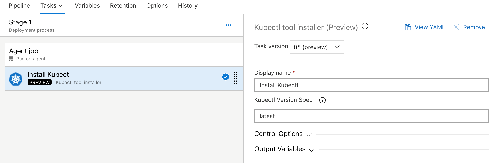
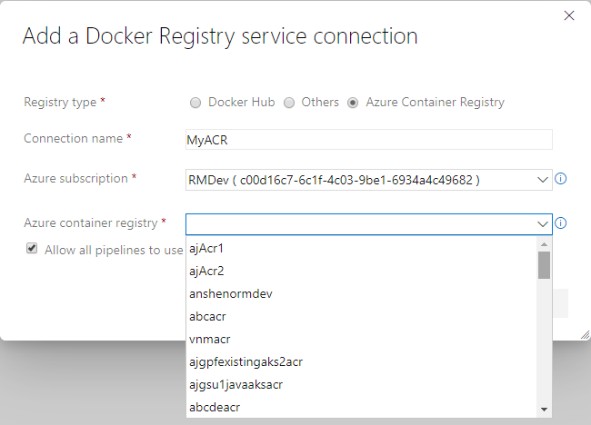
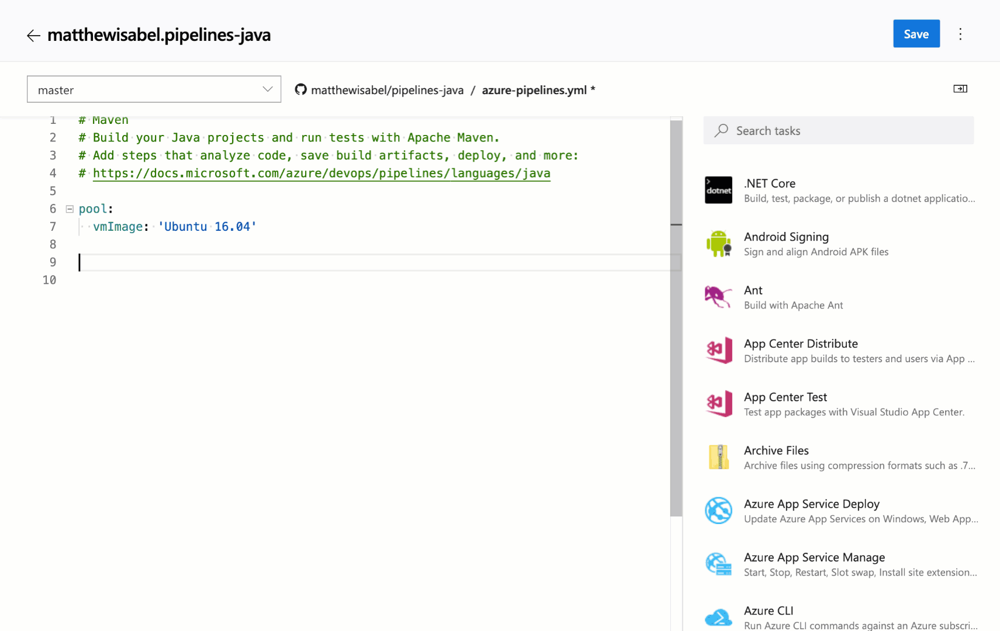

### Kubernetes manifest task

We added a new task to our release pipelines to simplify the process of deploying to Kubernetes clusters using manifest files. This task will provide the following benefits in comparison to the usage of kubectl binary in scripts:

* Artifact substitution - The deploy action takes as input a list of container images which can be specified along with their tags or digests. This is substituted into the non-template version of the manifest files before applying it to the cluster to ensure that the right version of the image is pulled by the cluster's nodes.

* Manifest stability - Rollout status is checked for the Kubernetes objects deployed to incorporate stability checks while computing the task status as success/failure.

* Traceability annotations - Annotations are added to the deployed Kubernetes objects to superimpose traceability information about originating organization, project, pipeline, and run.

* Bake manifest - The bake action of the task allows for baking Helm charts into Kubernetes manifest files so that they can be applied to the cluster.

* Deployment strategy - Choosing canary strategy with deploy action leads to creation of desired percentage of workloads suffixed with **-baseline** and **-canary** so that they can be compared during a `ManualIntervention` task before utilizing the promote/reject action of the task to finalize the version to be retained.

```yaml
steps:
- task: KubernetesManifest@0
  name: bake
  displayName: Bake K8s manifests from Helm chart
  inputs:
    action: bake
    helmChart: charts/sample
    overrides: 'image.repository:nginx'

- task: KubernetesManifest@0
  displayName: Deploy K8s manifests
  inputs:
    kubernetesServiceConnection: k8sSC1
    manifests: $(bake.manifestsBundle)
    containers: |
      nginx: 1.7.9
```

### Upgrades to Docker task

We upgraded the Docker task to simplify the pipeline authoring experience. The **buildAndPush** command can now be used to build multiple tags for a specific container repository and push it to multiple container registries in a single step. The task can use Docker registry service connections for logging into container registries. Traceability metadata about source repository, commit and build provenance are added as labels to the images built using this task.

```yaml
steps:
- task: Docker@2
  displayName: Container registry login - ACR1 service connection
  inputs:
    command: login
    containerRegistry: acr1
- task: Docker@2
  displayName: Container registry login - ACR2 service connection
  inputs:
    command: login
    containerRegistry: acr2
- task: Docker@2
  displayName: Build and push images
  inputs:
    repository: test
    tags: |
      d1
      d2
```

### Kubectl tool installer

We added a new task that allows you to install a specific version of the Kubectl binary on the agents. The **latest** and **semver** version strings such as 'v1.14.0' are accepted as valid values for the Kubectl Version Spec input.

> [!div class="mx-imgBorder"]


### Azure container registry in Docker registry service connection

Now you can create a Docker registry service connection from your project's settings page. To create the connection, choose an Azure container registry in one of the subscriptions associated with your Azure Active Directory (AAD) identity. All tasks requiring service connections to container registries such as **Docker@2** and **KubernetesManifest@0** will support a single way of specifying a connection.

> [!div class="mx-imgBorder"]


### cgroup support on hosted Ubuntu pool

On Linux, when memory usage gets too high, the kernel will terminate some processes to protect the remainder. If the Azure Pipelines agent process is selected for termination, your pipeline run will fail with an error message about losing communication with the agent. On the Microsoft-hosted Ubuntu pool, we've reduced the chances that the agent will be terminated by running steps inside a custom **cgroup**. While your pipeline may still fail if you exceed available memory, the agent process is more likely to survive and report the failure correctly. If you run a private Linux agent, we've [published](https://github.com/Microsoft/azure-pipelines-agent/blob/master/docs/start/resourceconfig.md) the settings we use so you can consider a similar setup.

### Run once agent

If you're using infrastructure such as Azure Container Instances to run elastic private agents, often, you want each agent to accept only one job before going away. Until now, this wasn't easy since you had to terminate the agent (possibly causing a failure to be reported) or accept the risk that an agent might receive another job before you could shut it down. With this update, we added the **--once** flag to the agent configuration. When you configure the agent this way, it'll accept only one job and then shut itself down.

### Support for Visual Studio 2019 (VS2019) in Visual Studio Test task

We've added support for VS2019 to the Visual Studio Test task in pipelines. To run tests using the test platform for VS2019, select the **Latest** or **Visual Studio 2019** options from the Test platform version dropdown.

> [!div class="mx-imgBorder"]
 in Visual Studio Test task")

### Agent pool user interface update

The agent pools management page in project settings has been updated with a new user interface. Now you can easily see all the jobs that are running in a pool. In addition you can learn why a job is not running.

> [!div class="mx-imgBorder"]
 update")

### Task assistant for editing YAML files

We continue to receive a lot of feedback asking to make it easier to edit YAML files for pipelines. In the previous updates, we added intellisense support. Now we are adding a task assistant to the YAML editor. With this, you will have the same familiar experience for adding a new task to a YAML file as in the classic editor. This new assistant supports most of the common task input types such as pick lists and service connections. To use the new task assistant, select **Edit** on a YAML-based pipeline, and then select the **Task assistant**.

> [!div class="mx-imgBorder"]


### Hosted pipelines image updates

We're excited to announce updates to the hosted **macOS pool** to **OS X Mojave** (10.4) which will also include support for **Xcode 10.2**. If your designer-based pipelines are using the **Hosted macOS** pool, your pipelines will automatically upgrade to Mojave. If you'd like to stay on OS X High Sierra (10.3), then change the pool your builds run on to **Hosted macOS High Sierra**.

If you are using YAML, the new vmImage labels that you can use are the following:

* Image label that will always point to the latest version of macOS, currently 10.4

```yaml
vmImage: 'macOS-latest'
```

* This image label specifically targets mac OS 10.4 if you want to be sure your pipeline runs against Mojave

```yaml
vmImage: 'macOS-10.14'
```

* Image label that will specifically target mac OS 10.3 if you want to be sure your pipeline runs against High Sierra

```yaml
vmImage: 'macOS-10.13'
```

We also made updates to the Windows Server 2019 image for your Hosted Azure Pipelines. The latest releases can be found [here](https://github.com/Microsoft/azure-pipelines-image-generation/releases). This update includes new versions of the VS2019 Preview, Docker, PowerShell Core, Node.js, npm, and others.

For more details about what's contained in our Hosted macOS VM images, and learn about the tools available on our images visit our [Image Generation repo](https://github.com/Microsoft/azure-pipelines-image-generation) on GitHub.

### Improvements to ServiceNow integration

Last December, we released the ServiceNow Change Management integration with release pipelines. A key capability for cross-team collaboration which enabled each team to use a service of their choice and have effective end-to-end delivery.
With this update, we enhanced the integration to support all types of changes (normal, standard and emergency). In addition, you can now specify the gate used to create a new change request using an existing template, as per the ITSM process followed in your organization. Finally, you can also gate releases based on existing change requests. This enables you to adopt CD, without needing to change the process recommended by your IT teams.

> [!div class="mx-imgBorder"]


### Support for Azure PowerShell Az module

Azure PowerShell provides a set of cmdlets that you can use to manage Azure resources from the command line. Last December, the Azure PowerShell Az module became available and is now the intended module for managing your Azure resources.  

Previously, we didn’t provide support for the Azure PowerShell Az module in our hosted agents. With the new Azure PowerShell task version 4.* in build and release pipelines, we have added support for the new Az module for all platforms. Azure PowerShell task version 3.* will continue to support the AzureRM module. However, to keep up with the latest Azure services and features, we recommend that you switch to the Azure PowerShell task version 4.* as soon as possible.

The Az module has a compatibility mode to help you use existing scripts while you update them to use the new syntax. To enable compatibility for the Az module, use the `Enable-AzureRmAlias` command. Aliases let you use the old cmdlet names with Az module. You can get more details on migrating from the Azure RM module to the Azure PowerShell Az module [here](https://docs.microsoft.com/powershell/azure/new-azureps-module-az?view=azps-1.5.0#migrate-existing-scripts-to-az).

> [!NOTE]
> You need to install the Az module on your agent machine if you are using private agents.

For more information on the Azure PowerShell Az module, see the documentation [here](https://docs.microsoft.com/powershell/azure/new-azureps-module-az?view=azps-1.4.0&viewFallbackFrom=azps-1.3.0#the-future-of-support-for-azurerm).

### Resource authorization improvements

We needed to provide security for protected resources (e.g., service connections, variable groups, agent pools, secure files) when referenced in a YAML file. At the same time, we wanted to make it easier for you to set up and use pipelines that use these types of resources for non-production scenarios. Previously, we added a setting to mark a resource as 'authorized for use in all pipelines'.

With this update, we are making it easier for you to fix a resource authorization problem even if you have not marked a resource as such. In the new experience, when a build fails because of a resource authorization error, you will see an option to explicitly authorize the use of those resources in the pipeline, and then proceed. Team members with permissions to authorize resources will be able to complete this action right from a failed build.

> [!div class="mx-imgBorder"]


### Simplified retention policies for build pipelines

We simplified the retention model for all build pipelines including YAML builds. There is a new setting at the project level that lets you control how many days you want to retain the builds of each pipeline and how many days you want to retain the artifacts of each build. If you used the classic editor to create your build pipeline, then the older retention settings will continue to be honored, but newer pipelines will use the new settings. You can manage retention under the **pipelines settings** page of **project settings**.

### Pipeline artifacts fetched automatically in release

Previously, if the build pipeline linked to a release had published artifacts using the **Publish Pipeline Artifact** task, the artifacts were not automatically fetched in release. Instead you had to explicitly add a **Download Pipeline Artifact** task in the release pipeline to download the artifacts.

Now, any pipeline artifacts published by the build pipeline are automatically downloaded and made available for you in the release. You can also customize the download of your pipeline artifact from the phase properties of the release pipeline.

### Cobertura code coverage report updates

Previously, when you ran tests in pipeline and published code coverage results to Azure DevOps, it was necessary to specify both the XML summary and an HTML report file. Additionally, styles in the HTML reports were removed before they were rendered in the code coverage tab. This removal of styling was necessary from a security standpoint as arbitrary HTML files could be uploaded.

With this update we have addressed these limitations for Cobertura coverage reports. When publishing code coverage reports, you no longer need to specify HTML files. Reports are automatically generated and are rendered with appropriate styling in the code coverage tab. This capability uses the open source tool [ReportGenerator](https://github.com/danielpalme/ReportGenerator).

> [!div class="mx-imgBorder"]

