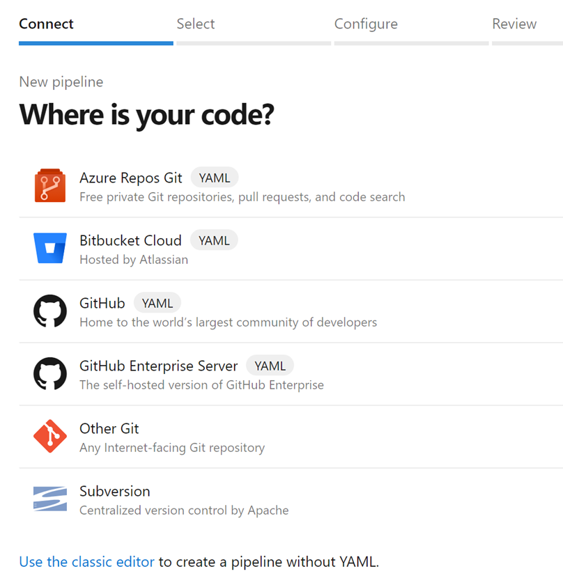

### Azure Pipelines app for Microsoft Teams

We're excited to announce the new Azure Pipelines app for Microsoft Teams. You can now easily monitor Azure DevOps Pipelines and approve releases in Teams. In addition, you can manage subscriptions for completed builds, releases, pending approvals and get notifications for these events in your Teams channels.

To get started, install the Azure Pipelines app from the Microsoft Teams app store and see the documentation [here](https://docs.microsoft.com/azure/devops/pipelines/integrations/microsoft-teams?view=azure-devops).

> [!div class="mx-imgBorder"]
> 

### Updates to pipeline creation experience

Previously, we had two entry points when you created a build pipeline. One for classic build pipelines and another for YAML build pipelines. Whether you saw one or the other was controlled by a preview features toggle. 

With this update we removed the preview features toggle so you will have a single entry point that covers both YAML and classic builds. The new experience supports all the repo types that were supported in the classic experience. However, if a repo type supports both YAML and classic builds (e.g., GitHub or Azure Repos), the preference is given to YAML builds. You can always override and choose the classic editor to create a pipeline without YAML.

> [!div class="mx-imgBorder"]
> 
