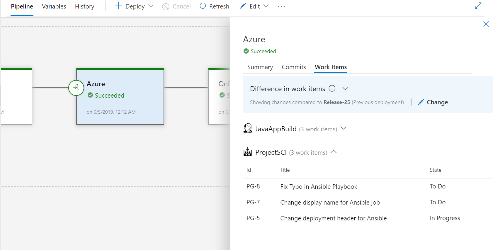
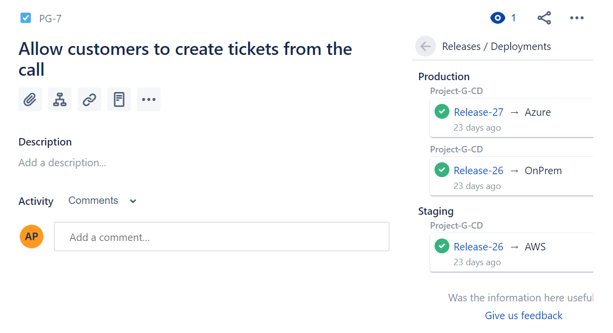
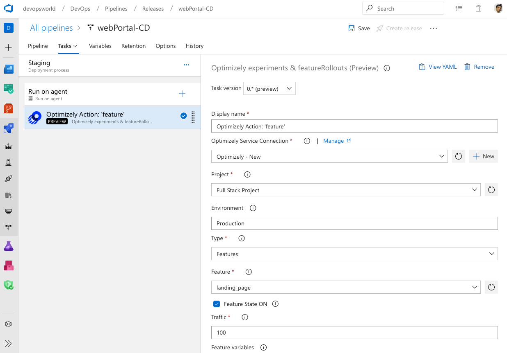
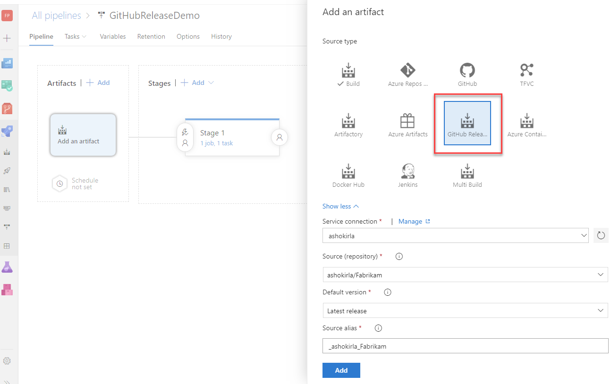
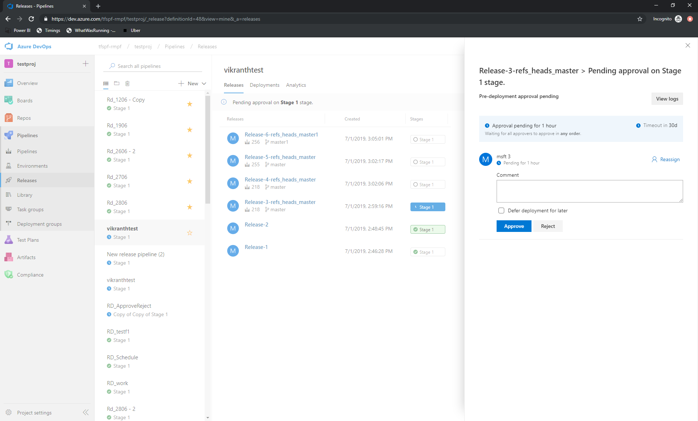
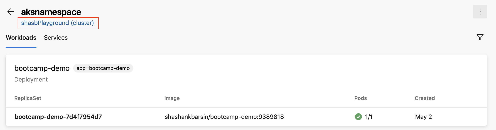
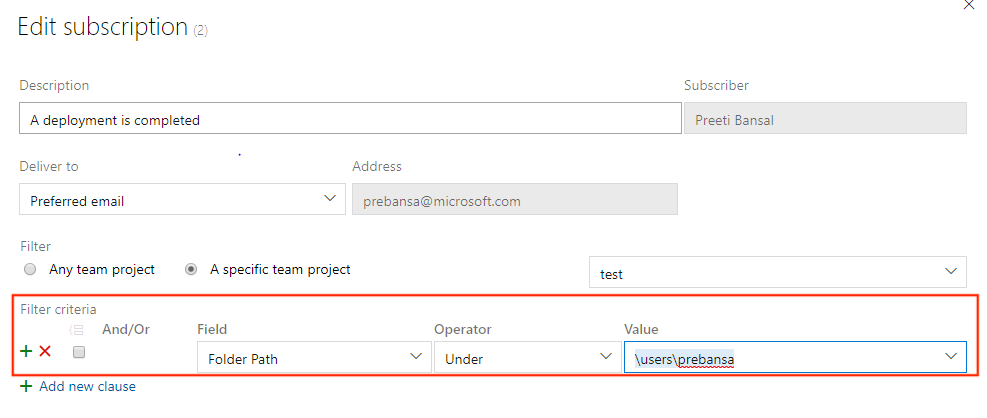
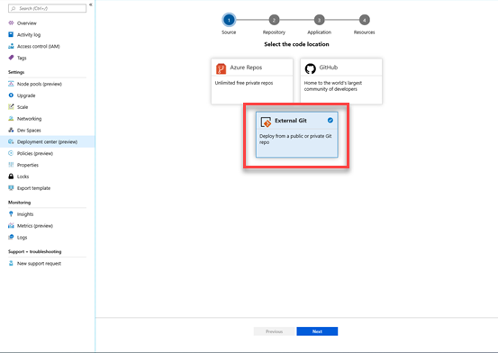
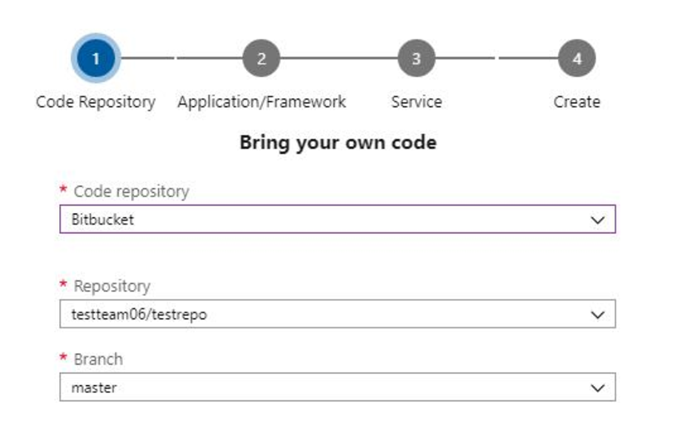
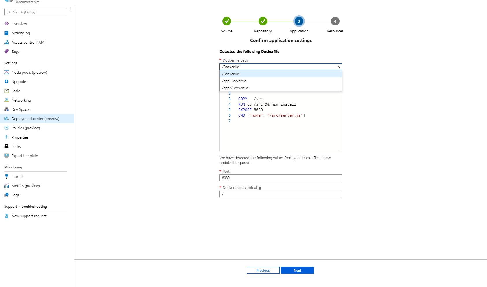

### Azure Pipelines app for Jira

We are excited to announce the availability of the [Azure Pipeline app for Jira](https://marketplace.atlassian.com/apps/1220515/azure-pipelines-for-jira?hosting=cloud&tab=overview). The integration enables bi-directional linking between releases in Azure Pipelines and issues in Jira software cloud. It simplifies the generation of release notes by tracking Jira issues mentioned in GitHub commits deployed with releases. 

> [!div class="mx-imgBorder"]
> 

In addition, it displays build and release information from Azure Pipelines and shows it in the development panel of the issues. This enabled tracking of how and when an issue is delivered, and provides a tight development cycle from issue creation to deployments tracked in Jira.

> [!div class="mx-imgBorder"]
> 

To learn more about the Azure Pipelines integration with Jira software cloud, see the documentation [here](https://github.com/microsoft/azure-pipelines-jira/blob/master/tutorial.md).

### Improvements to the Azure Pipelines app for Slack

In February, we released the Azure Pipelines app for Slack to help you monitor your pipelines. With this update, we enhanced the app.
Will use <strong>@mention</strong> in the Slack channel when there is a notification for a failed build that you triggered. In addition, it will notify you when you are an approver on a release deployment approval pending notification.

In addition, you can now paste a link to a build or release in the Azure Pipelines app and get a rich preview of the pipeline. This adds context to the link and makes it easier to navigate to Azure DevOps.

For example, pasting a link to a build shows the details of the build and the current status.

> [!div class="mx-imgBorder"]
>  in Azure Pipelines app for Slack")

For more details about this update, see the blog post with the full announcement [here](https://devblogs.microsoft.com/devops/link-unfurling-preview-in-azure-pipelines-app-for-slack).

### Single hosted pool

> [!NOTE]
> This is an upcoming change that we wish to communicate in advance.

Having multiple hosted pools can be confusing at times. You do not get an accurate picture of where concurrency is being consumed. For example, if you have a concurrency of 10 parallel jobs, you see 10 virtual agents in each of the hosted pools, which is not accurate. When your job is waiting on a specific hosted pool (e.g. Hosted VS2017) with all idle agents, you may think that Azure Pipelines service is broken without realizing that the concurrency is possibly consumed in other hosted pools (e.g. Hosted Ubuntu 1604). 

We will update our agent pool management experiences to include a new unified hosted agent pool called Azure Pipelines. This will soon replace the other hosted pools that you have - Hosted, Hosted VS2017, Hosted Ubuntu 1604, Hosted Windows 2019 with VS2019, Hosted macOS, and Hosted macOS High Sierra.

Once this feature is deployed, you will see a single hosted pool that will give you an accurate picture of how many jobs are running in that pool. We plan to roll out this change over the next few sprints. You will not have to make any changes to your pipelines since we will automatically redirect jobs from the old hosted pools to the appropriate image in the new unified pool.

### Updated Agent Pool interface in organization settings

Previously, we changed the agent pools management page in project settings to include a new user interface. With this update, we are updating the agent pools interface under the organization settings. This new interface will help with an upcoming feature that will include consolidation for hosted pools and the ability to track the consumption of concurrent jobs. 

For more details about the upcoming feature see the release note on [single hosted pool](#single-hosted-pool).

### Control variables that can be overridden at queue time

Currently, you can use the UI or REST API to update the values of any variable prior to starting a new run. While the pipeline's author can mark certain variables as `_settable at queue time_`, the system didn't enforce this, nor prevented other variables from being set. In other words, the setting was only used to prompt for additional inputs when starting a new run. 

We've added a new organization setting that enforces the `_settable at queue time_` parameter. This will give you control over which variables can be changed when starting a new run. Going forward, you can't change a variable that is not marked by the author as `_settable at queue time_`. 

> [!NOTE]
> This setting is off by default in existing organizations, but it will be on by default when you create a new Azure DevOps organization.

### Support for large test attachments

The publish test results task in Azure Pipelines lets you publish test results when tests are executed to provide a comprehensive test reporting and analytics experience. Until now, there was a limit of 100MB for test attachments for both test run and test results.  This limited the upload of big files like crash dumps or videos. With this update, we added support for large test attachments allowing you to have all available data to troubleshoot your failed tests. 

### Deployments in YAML pipeline

A deployment job is a special type of [job](https://docs.microsoft.com/en-us/azure/devops/pipelines/yaml-schema?view=azure-devops&tabs=schema#job) that is used to deploy your app to an environment. 
With this update, we have added support for [step references](https://docs.microsoft.com/en-us/azure/devops/pipelines/yaml-schema?view=azure-devops&tabs=schema#step-templates) in a deployment job. For example, you can define a set of steps in one file and refer to it in a deployment job. 

We have also added support for additional properties to the deployment job. For example, here are few properties of a deployment job that you can now set,
- **timeoutInMinutes** - how long to run the job before automatically cancelling
- **cancelTimeoutInMinutes** - how much time to give 'run always even if cancelled tasks' before terminating them
- **condition** - run job conditionally
- **variables** - Hardcoded values can be added directly, or [variable groups](https://docs.microsoft.com/en-us/azure/devops/pipelines/library/variable-groups?view=azure-devops&tabs=yaml), 
[variable group backed by an Azure key vault](https://docs.microsoft.com/en-us/azure/devops/pipelines/library/variable-groups?view=azure-devops&tabs=yaml#link-secrets-from-an-azure-key-vault) can be referenced 
or you can refer to a set of [variables defined in a file](https://docs.microsoft.com/en-us/azure/devops/pipelines/yaml-schema?view=azure-devops&tabs=schema#variable-templates).
- **continueOnError** - if future jobs should run even if this deployment job fails; defaults to 'false'

For more details about deployment jobs and the full syntax to specify a deployment job, see [Deployment job](https://docs.microsoft.com/en-us/azure/devops/pipelines/process/deployment-jobs?view=azure-devops).

### Optimizely integration

Optimizely is a powerful A/B testing and feature flagging platform for product teams. 
Integration of Azure Pipelines with Optimizely experimentation platform empowers product teams to test, learn and deploy at an accelerated pace, while gaining all DevOps benefits from Azure Pipelines. 

The Optimizely extension for Azure DevOps adds experimentation and feature flag rollout steps to the build and release pipelines, so you can continuously iterate, roll features out, and roll them back using Azure Pipelines.

Learn more about the Azure DevOps Optimizely extension [here](https://marketplace.visualstudio.com/items?itemName=ms-devlabs.AzureDevOpsOptimizely).

> [!div class="mx-imgBorder"]
> 

### Add a GitHub release as an artifact source

Now you can link your GitHub releases as artifact source in Azure DevOps release pipelines. This will let you consume the GitHub release as part of your deployments.

When you click **Add an artifact** in the release pipeline definition, you will find the new **GitHub Release** source type. You can provide the service connection and the GitHub repo to consume the GitHub release. You can also choose a default version for the GitHub release to consume as latest, specific tag version or select at release creation time. Once a GitHub release is linked, it is automatically downloaded and made available in your release jobs.

> [!div class="mx-imgBorder"]
> 

### Pay for additional pipelines from the Azure DevOps portal

Previously, you had to go to the Marketplace to pay for additional pipelines. Now you can buy additional pipelines from the Azure DevOps portal. You can increase or decrease the count of Microsoft-hosted or self-hosted CI/CD from **Organization Settings > Billing**. 

To learn more visit the documentation about buying CI/CD [here](https://docs.microsoft.com/en-us/azure/devops/organizations/billing/buy-more-build-vs?view=azure-devops).

### Approve releases directly from Releases hub

Acting to pending approvals made easier. So far, it was possible to approve a release from the details page of the release. We now make it possible for you to approve releases directly from the Releases hub.

> [!div class="mx-imgBorder"]
> 

### Azure Kubernetes Service Cluster link in Kubernetes environments resource view

We added a link to the resource view of Kubernetes environments so you can navigate to the Azure blade for the corresponding cluster. This applies to environments that are mapped to namespaces in Azure Kubernetes Service clusters.

> [!div class="mx-imgBorder"]
> 

### Release folder filters in notification subscriptions

Folders allow organizing pipelines for easier discoverability and security control. Often you may want to configure custom email notifications for all release pipelines, that are represented by all pipelines under a folder.
Previously, you had to configure multiple subscriptions or have complex query in the subscriptions to get focused emails. With this update, you can now add a release folder clause to the **deployment completed** and **approval pending** events and simplify the subscriptions. 

> [!div class="mx-imgBorder"]
> 

### Deploy external Git repositories to Azure Kubernetes Services (AKS)

Previously, we supported Azure Repos and GitHub as code locations in the AKS deployment center. With this update, we are adding support for **External Git** repos so you can deploy your code from any public or private Git repository to AKS.

> [!div class="mx-imgBorder"]
> 

### Support for BitBucket repositories in DevOps Projects

We've added support for BitBucket repositories to DevOps Projects. Now you can get OAuth experience and a populated list of repositories and branches to select from when deploying to Azure resources.

> [!div class="mx-imgBorder"]
> 

### Select a Dockerfile in deployment center for AKS and WebApp Containers

You can now select a Dockerfile in the deployment center for AKS and WebApp Containers. This will be helpful when you want to maintain different versions of Dockerfile or have multiple application in the same repo.  With this you will be able to select the specific DockerFile/application you want to push.

> [!div class="mx-imgBorder"]
> 