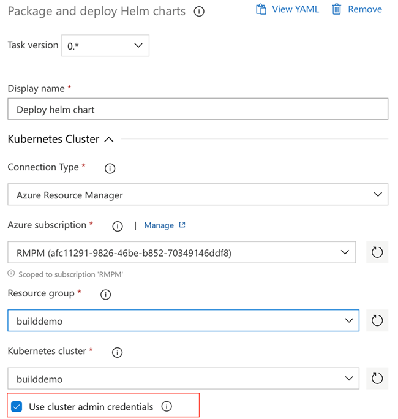
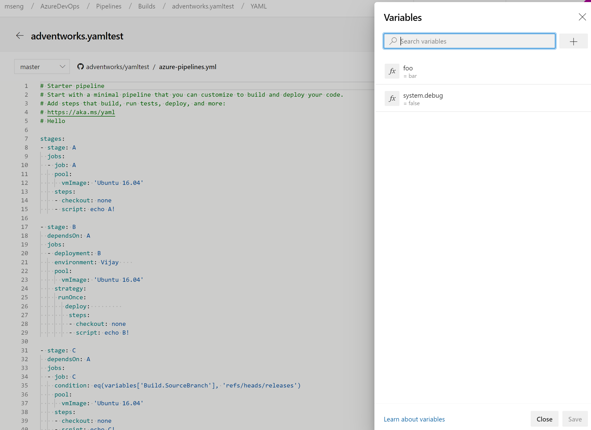
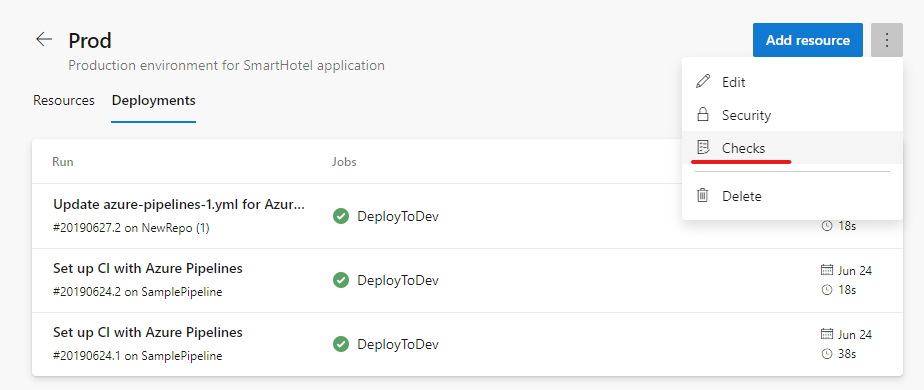
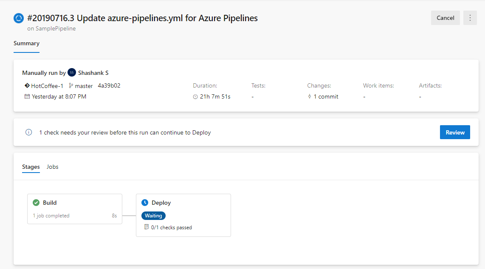
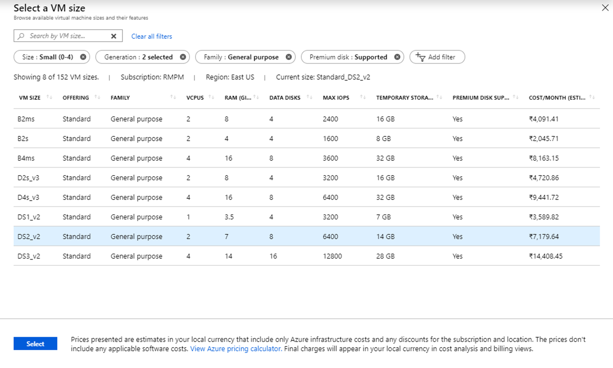
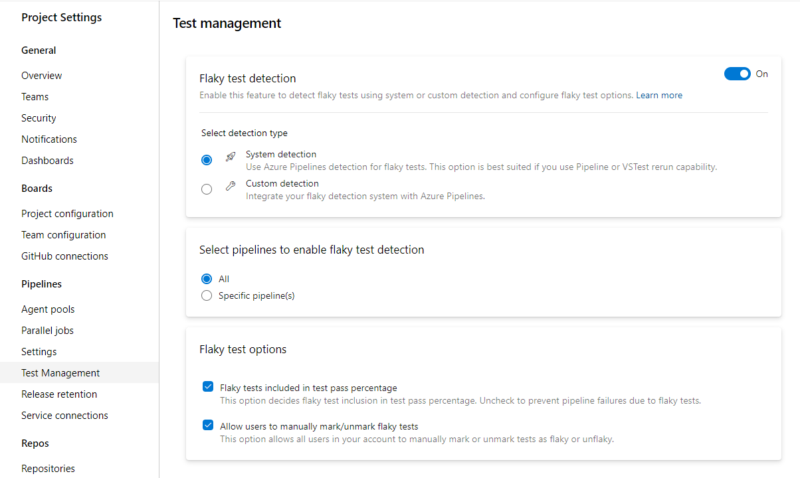
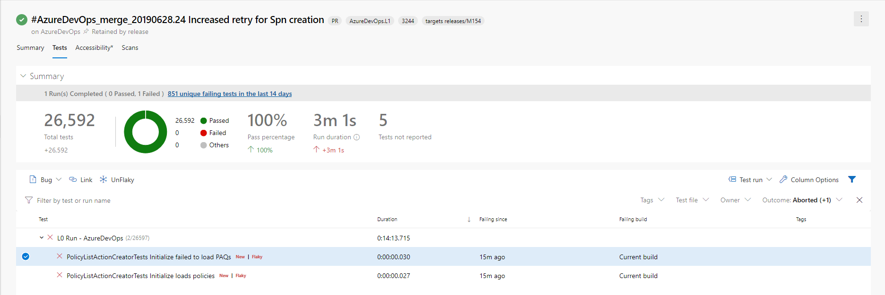
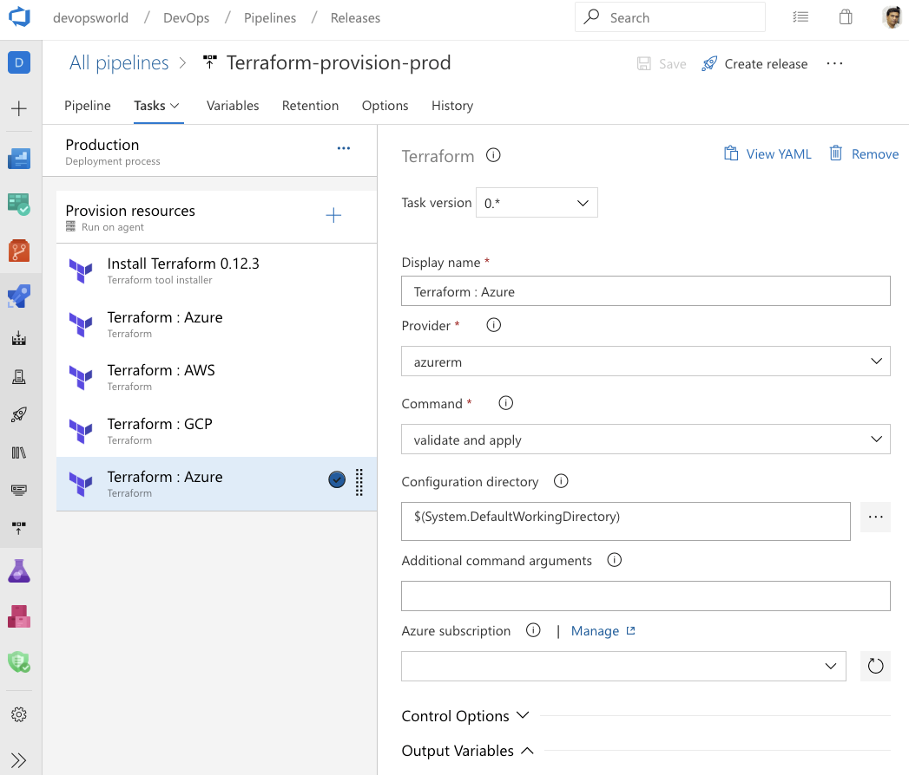
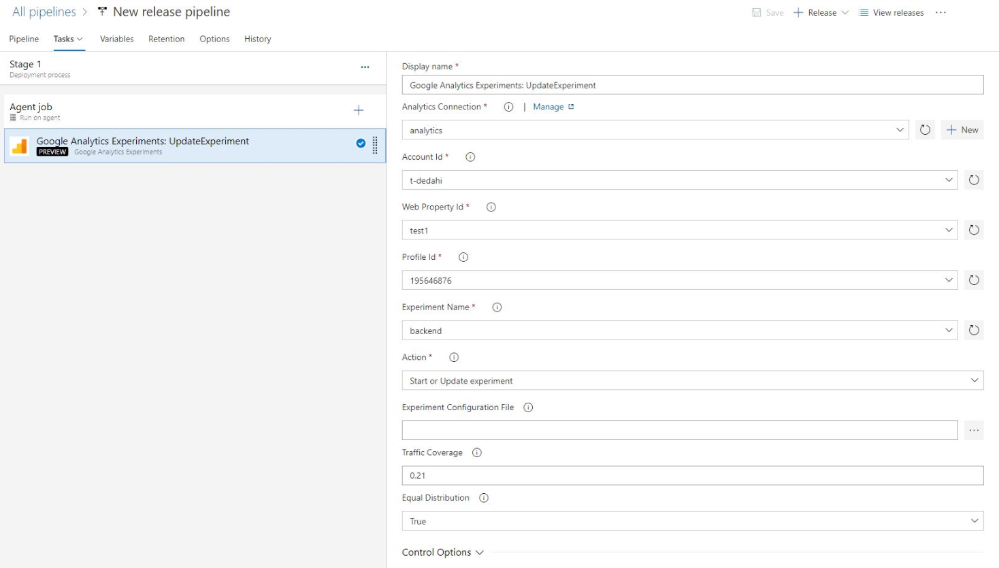

### kustomize and kompose as bake options in KubernetesManifest task

[kustomize](https://github.com/kubernetes-sigs/kustomize) (part of Kubernetes sig-cli) let you customize raw, template-free YAML files for multiple purposes and leaves the original YAML untouched. An option for kustomize has been added under bake action of [KubernetesManifest task](https://docs.microsoft.com/azure/devops/pipelines/tasks/deploy/kubernetes-manifest?view=azure-devops) so that any folder containing kustomization.yaml files can be used for generating the manifest files used in the deploy action of the KubernetesManifest task.

```YAML
steps:
- task: KubernetesManifest@0
  name: bake
  displayName: Bake K8s manifests from Helm chart
  inputs:
    action: bake
    renderType: kustomize
    kustomizationPath: folderContainingKustomizationFile

- task: KubernetesManifest@0
  displayName: Deploy K8s manifests
  inputs:
    kubernetesServiceConnection: k8sSC1
    manifests: $(bake.manifestsBundle)
```

[kompose](https://github.com/kubernetes/kompose) will transform a Docker Compose files into a Kubernetes resource.

```YAML
steps:
- task: KubernetesManifest@0
  name: bake
  displayName: Bake K8s manifests from Helm chart
  inputs:
    action: bake
    renderType: kompose
    dockerComposeFile: docker-compose.yaml

- task: KubernetesManifest@0
  displayName: Deploy K8s manifests
  inputs:
    kubernetesServiceConnection: k8sSC1
    manifests: $(bake.manifestsBundle)
```

### Support for cluster admin credentials in HelmDeploy task

Previously, the **HelmDeploy** task used the cluster user credentials for deployments. This resulted in interactive login prompts and failing pipelines for an Azure Active Directory based RBAC enabled cluster. To address this issue, we added a checkbox that lets you use cluster admin credentials instead of a cluster user credentials.

> [!div class="mx-imgBorder"]
> 

### Manage pipeline variables in YAML editor

We updated the experience for managing pipeline variables in the YAML editor. You no longer have to go to the classic editor to add or update variables in your YAML pipelines.

> [!div class="mx-imgBorder"]
> 

### New predefined variables in YAML pipeline

Variables give you a convenient way to get key bits of data into various parts of your pipeline. With this update we've added a few predefined variables to a deployment job. These variables are automatically set by the system, scoped to the specific deployment job and are read-only.

* Environment.Id - The ID of the environment.
* Environment.Name - The name of the environment targeted by the deployment job.
* Environment.ResourceId - The ID of the resource in the environment targeted by the deployment job.
* Environment.ResourceName - The name of the resource in the environment targeted by the deployment job.

### Link work items with multi-stage YAML pipelines

Currently, you can automatically link work items with classic builds. However, this was not possible with YAML pipelines. With this update we have addressed this gap. When you run a pipeline successfully using code from a specified branch, Azure Pipelines will automatically associate the run with all the work items (which are inferred through the commits in that code). When you open the work item, you will be able to see the runs in which the code for that work item was built. To configure this, use the settings panel of a pipeline.

### Cancel stage in a multi-stage YAML pipeline run

When running a multi-stage YAML pipeline, you can now cancel the execution of a stage while it is in progress. This is helpful if you know that the stage is going to fail or if you have another run that you want to start. This feature is also a pre-requisite for us to support retrying a failed stage in the future.

### Approvals in multi-stage YAML pipelines

We continue to improve multi-stage YAML pipelines, we now let you add manual approvals to these pipelines. Infrastructure owners can protect their environments and seek manual approvals before a stage in any pipeline deploys to them.
With complete segregation of roles between infrastructure (environment) and application (pipeline) owners, you will ensure manual sign off for deployment in a particular pipeline and get central control in applying the same checks across all deployments to the environment.

> [!div class="mx-imgBorder"]
> 

The pipeline runs deploying to dev will stop for approval at the start of the stage.

> [!div class="mx-imgBorder"]
> 

### Updates to hosted pipelines images

We've made updates to several of the Azure Pipelines hosted VM images. You can find more details about the latest releases [here](https://github.com/microsoft/azure-pipelines-image-generation/releases). The following changes were added as part of this update:

* For VS2017 and VS2019:
    * Added Azul Java 7
    * [Pinned cached Docker images](https://github.com/microsoft/azure-pipelines-image-generation/pull/1036) to match host kernel version
    * Added Az Powershell Module v2.3.2
    * Pinned Mercurial to v5.0.0
    * Updated Python to versions 2.7.16, 3.4.4, 3.5.4, 3.6.8, 3.7.4
    * Added Portable Class Library (VS 2019 only)
    * Changed [Rust default paths and environment variables](https://github.com/microsoft/azure-pipelines-image-generation/pull/1056)

* For Ubuntu 16.04:
    * Updated helm to always pull latest (no longer pinned at v2.14.0)
    * Added several [popular Docker containers](https://github.com/microsoft/azure-pipelines-image-generation/pull/1060)
    * Updated Python to versions 2.7.16, 3.4.10, 3.5.7, 3.6.9, 3.7.4
    * Changed Rust default paths and environment variables

* For all images, added an `ImageVersion` environment variable for the version of the image

For a full list of tools available for a particular image, go to **Settings > Agent pools > Details**.

### Enhancements to DevOps Project for virtual machine

In this update, we enhanced the DevOps Projects virtual machine (VM) workflow to include the VMs that don't comply with the per location quota restriction.  Previously, you had to choose the VM by name and offering. Now, you have an on-demand view with more details about the VM offerings such as cost/month, RAM, data disks etc. This makes it easier for you to select the virtual machine that you need.

> [!div class="mx-imgBorder"]
> 

### Single hosted pool

In the last sprint, we communicated that we are rolling out a new hosted pool called Azure Pipelines to replace all the other hosted pools - Hosted, Hosted VS2017, Hosted Ubuntu 1604, Hosted Windows 2019 with VS2019, Hosted macOS, and Hosted macOS High Sierra. This change will be implemented with this release.

Having multiple hosted pools can be confusing at times. You do not get an accurate picture of where concurrency is being consumed. For example, if you have a concurrency of 10 parallel jobs, you see 10 virtual agents in each of the hosted pools, which is not accurate. When your job is waiting on a specific hosted pool (e.g. Hosted VS2017) with all idle agents, you may think that Azure Pipelines service is broken without realizing that the concurrency is possibly consumed in other hosted pools (e.g. Hosted Ubuntu 1604). 

With this change, you will see a single hosted pool that will give you an accurate picture of how many jobs are running in that pool. We plan to roll out this change over the next few sprints. You will not have to make any changes to your pipelines since we will automatically redirect jobs from the old hosted pools to the appropriate image in the new unified pool.

### Show correct pool information on each job

Previously, when you used a matrix to expand jobs or a variable to identify a pool, we had trouble showing correct pool information in the logs pages. With this update, we fixed the issues causing incorrect pool information to be shown for certain jobs.

### In-product support for flaky test management

Flaky tests can affect developers' productivity since test failures may not be related to the changes under test. They can also impact the quality of shipped code. This is why we added in-product support for flaky test management. This functionality supports end-to-end lifecycle with detection, reporting and resolution. Flaky test management supports system and custom detection. 

System detection is available via VSTest task rerun capability. A flaky test is a test that provides different outcomes, such as pass or fail, even when there are no changes in the source code or execution environment. All further executions of test for the same branch are also marked flaky until its resolved and unmarked. You can also plug in your custom detection mechanism using our APIs. Once a test is identified as flaky, you can get the details in the in-context test report in the pipeline. You can then decide whether the flaky tests impact your pipeline failure. By default, flaky test information is available as additional meta-data.  

> [!div class="mx-imgBorder"]
> 

Here is an example of a report with the test summary. 

> [!div class="mx-imgBorder"]
> 

For more details about flaky test management, see the documentation [here](https://docs.microsoft.com/azure/devops/pipelines/test/flaky-test-management?view=azure-devops).

### Improvements to the Deployment Center for WebApp in the Azure Portal

We've improved the Deployment Center for WebApp in the Azure Portal with support for pipelines with multiple artifacts. Now, if a non-primary artifact of Azure Pipelines is deployed on the web app, you will get relevant details from the Azure Portal. You will also have a deep link to the deployed repo to navigate directly to the repo from the Azure Portal. The repo can be hosted in Azure Repos or in GitHub.

### CI triggers for new branches

It has been a long pending request to not trigger CI builds when a new branch is created and when that branch doesn't have changes. Consider the following examples:

* You use the web interface to create a new branch based on an existing branch. This would immediately trigger a new CI build if your branch filter matches the name of the new branch. This is unwanted because the content of the new branch is the same when compared to the existing branch. 
* You have a repository with two folders - app and docs. You set up a path filter for CI to match "app". In other words, you do not want to create a new build if a change has been pushed to docs. You create a new branch locally, make some changes to docs, and then push that branch to the server. We used to trigger a new CI build. This is unwanted since you explicitly asked not to look for changes in docs folder. However, because of the way we handled a new branch event, it would seem as if a change has been made to the app folder as well.

Now, we have a better way of handling CI for new branches to address these problems. When you publish a new branch, we explicitly look for new commits in that branch, and check whether they match the path filters.

### Terraform integration with Azure Pipelines

Terraform is an open-source tool for developing, changing and versioning infrastructure safely and efficiently. Terraform codifies APIs into declarative configuration files allowing you to define and provision infrastructure using a high-level configuration language. You can use the Terraform extension to create resources across all major infrastructure providers: Azure, Amazon Web Services (AWS) and Google Cloud Platform (GCP). 

To learn more about the Terraform extension, see the documentation [here](https://marketplace.visualstudio.com/items?itemName=ms-devlabs.custom-terraform-tasks).

> [!div class="mx-imgBorder"]
> 

### Integration with Google Analytics

The Google Analytics experiments framework lets you test almost any change or variation to a website or app to measure its impact on a specific objective. For example, you might have activities that you want your users to complete (e.g., make a purchase, sign up for a newsletter) and/or metrics that you want to improve (e.g., revenue, session duration, bounce rate). These activities let you identify changes worth implementing based on the direct impact they have on the performance of your feature. 

The Google Analytics experiments extension for Azure DevOps adds experimentation steps to the build and release pipelines, so you can continuously iterate, learn and deploy at an accelerated pace by managing the experiments on a continuous basis while gaining all the DevOps benefits from Azure Pipelines. 

> [!NOTE]
> The extension will be available within the next week.

> [!div class="mx-imgBorder"]
> 

### Pipeline caching (public preview)

Pipeline caching lets you save the results of a long-running operation, like a package restore or a dependency compilation, and restore it back during the next run of a pipeline. This can result in faster builds. 

For more details, see the blog post with the full announcement [here](https://devblogs.microsoft.com/devops/caching-and-faster-artifacts-in-azure-pipelines/).

### Pipeline variable group and variable management commands

It can be challenging to port YAML based pipelines from one project to another as you need to manually set up the pipeline variables and variable groups. However, with the pipeline [variable group](https://docs.microsoft.com/en-us/cli/azure/ext/azure-devops/pipelines/variable-group?view=azure-cli-latest) and [variable](https://docs.microsoft.com/en-us/cli/azure/ext/azure-devops/pipelines/variable?view=azure-cli-latest) management commands, you can now script the set up and management of pipeline variables and variable groups which can in turn be version controlled, allowing you to easily share the instructions to move and set up pipelines from one project to another.

### Run pipeline for a PR branch

When creating a PR, it can be challenging to validate if the changes might break the pipeline run on the target branch. However, with the capability to trigger a pipeline run or queue a build for a PR branch, you can now validate and visualize the changes going in by running it against the target pipeline. Refer [az pipelines run](https://docs.microsoft.com/en-us/cli/azure/ext/azure-devops/pipelines?view=azure-cli-latest#ext-azure-devops-az-pipelines-run) and [az pipelines build queue](https://docs.microsoft.com/en-us/cli/azure/ext/azure-devops/pipelines/build?view=azure-cli-latest#ext-azure-devops-az-pipelines-build-queue) command documentation for more information.

### Skip the first pipeline run

When creating pipelines, sometimes you want to create and commit a YAML file and not trigger the pipeline run as it may result in a faulty run due to a variety of reasons - infrastructure is not ready or need to create and update variable/variable groups etc. With Azure DevOps CLI,  you can now to skip the first automated pipeline run on creating a pipeline by including the --skip-first-run parameter.  Refer [az pipeline create command documentation](https://docs.microsoft.com/en-us/cli/azure/ext/azure-devops/pipelines?view=azure-cli-latest#ext-azure-devops-az-pipelines-create) for more information.

###Service endpoint command enhancement

Service endpoint CLI commands supported only azure rm and github service endpoint set up and management. However, with this release, service endpoint commands allow you to create any service endpoint by providing the configuration via file and provides optimized commands - az devops service-endpoint github and az devops service-endpoint azurerm, which provide first class support to create service endpoints of these types. Refer the [command documentation](https://docs.microsoft.com/en-us/cli/azure/ext/azure-devops/devops/service-endpoint?view=azure-cli-latest) for more information.