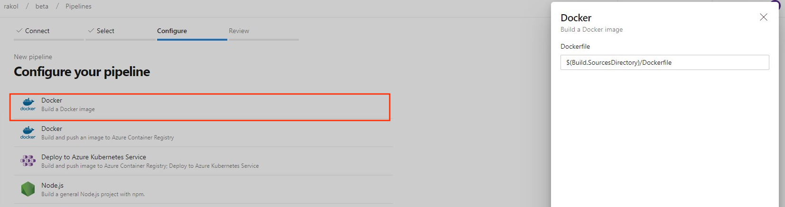
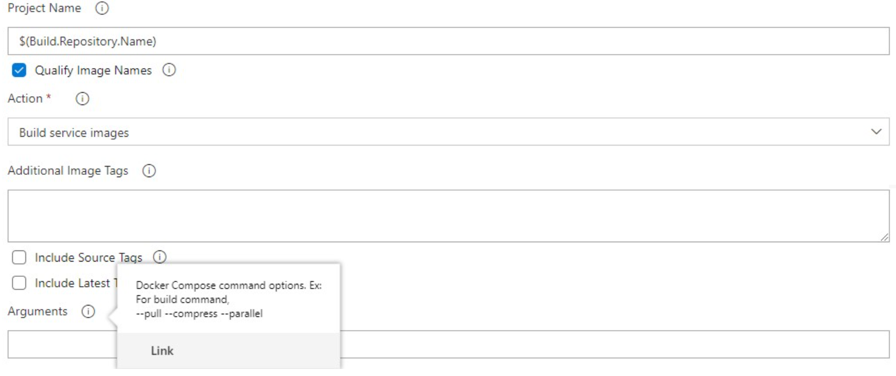
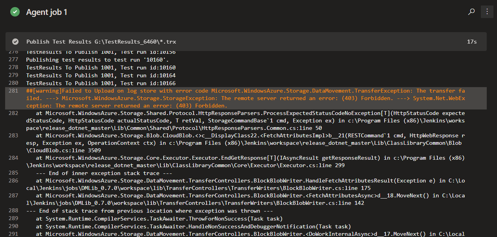
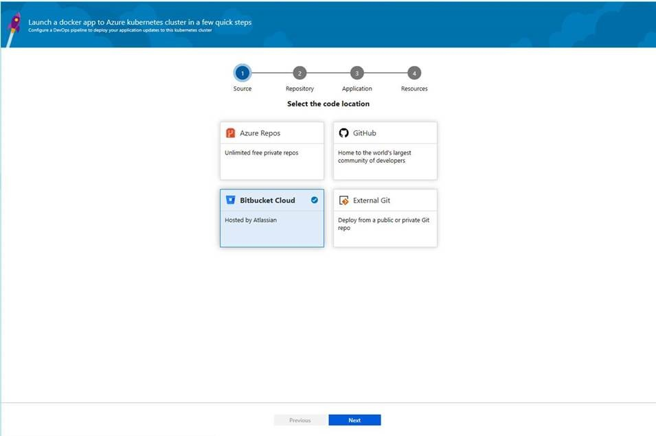
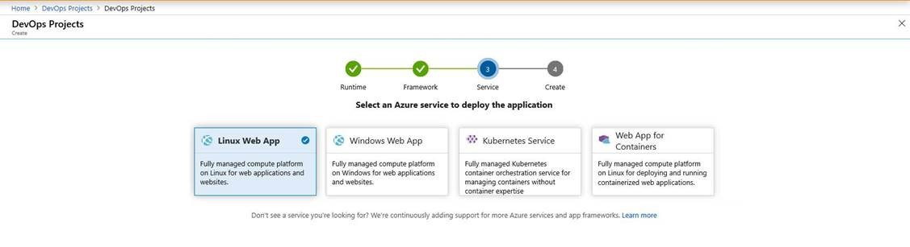

### Pipelines caching improvements

In the Sprint 155 Update, we announced the public preview of [pipeline caching](https://aka.ms/pipeline-caching-docs), a feature designed to reduce build time by allowing files, like downloaded dependencies and compilation outputs, to be reused by later run. In this update we added support for including multiple files in the cache key using glob patterns. For example:

``` 
steps:
- task: CacheBeta@0
  inputs:
    key:
    packages/**/package-lock.json, !node_modules/** | $(Agent.OS)
    path:
$(npm_config_cache)
```
> [!NOTE]
> Parts of the key need to be separated with a "|" character (as shown above). This change is being made in anticipation of the upcoming ability to specify alternate restore keys.

To get started, see the [pipeline caching documentation](https://aka.ms/pipeline-caching-docs).

### Increase in gates timeout limit and frequency

 Previously, the gate timeout limit in release pipelines was three days. With this update, the timeout limit has been increased to **15 days** to allow gates with longer durations. We also increased the frequency of the gate to **30 minutes**.

### New build image template for Dockerfile

Previously, when creating a new pipeline for a Dockerfile in new pipeline creation, the template recommended pushing the image to an Azure Container Registry and deploying to an Azure Kubernetes Service. We added a new template to let you build an image using the agent without the need to push to a container registry.

> [!div class="mx-imgBorder"]
> 

### Arguments input in Docker Compose task

A new field has been introduced in the Docker Compose task to let you add arguments such as `--no-cache`. The argument will be passed down by the task when running commands such as build.

> [!div class="mx-imgBorder"]
> 

### Fix warning in large test attachments

Last month, we added support for test attachments bigger than 100MB. Currently, you might see VSTest task or Publish test results task returning a 403 or 407 error in the logs. If you are using self-hosted builds or release agents behind a firewall which filters outbound requests, you will need to make some configuration changes to be able to use this functionality.
​
> [!div class="mx-imgBorder"]
> 

In order to fix this issue, we recommend that you update the firewall for **outbound requests** to `https://*.vstmrblob.vsassets.io`. You can find troubleshooting information in the documentation [here](https://docs.microsoft.com/en-us/azure/devops/organizations/security/faq-network-connections?view=azure-devops). 
​
> [!NOTE]
> This is only required if you're using self-hosted Azure Pipelines agents and you're behind a firewall that is filtering outbound traffic. If you are using Microsoft-hosted agents in the cloud or that aren't filtering outbound network traffic, you don't need to take any action.​

### Updates to hosted pipelines images

We've made updates to several of the Azure Pipelines hosted VM images. Highlights include:

* Added ATL for ARM and ARM64 with and without Spectre mitigations to VS 2017 (already present in VS 2019).
* Updated patch versions of Java and Go for Ubuntu 16.04, VS 2017, and VS 2019.
* Increased the limit for open files to 50,000 on Ubuntu 16.04.
* Various bug fixes.

You can find more details about the latest releases [here](https://github.com/microsoft/azure-pipelines-image-generation/releases). 

For a full list of tools available for a particular image, go to **Settings > Agent pools > Details**.

### Support for Bitbucket repositories in Deployment Center for AKS and Web App for containers

With this update, we added native support for BitBucket repositories to our Deployment Center workflows for AKS and Web App for containers. Now you can get OAuth experience and a populated list of repositories and branches of your Bitbucket account. This will help you deploy to your respective resources. In addition, we added an assisted experience by analyzing the Bitbucket repository selected and detecting the DockerFile.

> [!div class="mx-imgBorder"]
> 

### Linux Web App support for Java workflows in Azure DevOps Projects

Now you can create a Linux Web App and deploy a sample Java application with a few clicks in Azure DevOps Projects. We will host the sample Java application in Azure Repos and will setup a CI/CD pipeline for it.

> [!div class="mx-imgBorder"]
> 

### Pipeline variable group and variable management commands

It can be challenging to port YAML based pipelines from one project to another as you need to manually set up the pipeline variables and variable groups. However, with the pipeline [variable group](https://docs.microsoft.com/en-us/cli/azure/ext/azure-devops/pipelines/variable-group?view=azure-cli-latest) and [variable](https://docs.microsoft.com/en-us/cli/azure/ext/azure-devops/pipelines/variable?view=azure-cli-latest) management commands, you can now script the set up and management of pipeline variables and variable groups which can in turn be version controlled, allowing you to easily share the instructions to move and set up pipelines from one project to another.

### Run pipeline for a PR branch

When creating a PR, it can be challenging to validate if the changes might break the pipeline run on the target branch. However, with the capability to trigger a pipeline run or queue a build for a PR branch, you can now validate and visualize the changes going in by running it against the target pipeline. Refer [az pipelines run](https://docs.microsoft.com/en-us/cli/azure/ext/azure-devops/pipelines?view=azure-cli-latest#ext-azure-devops-az-pipelines-run) and [az pipelines build queue](https://docs.microsoft.com/en-us/cli/azure/ext/azure-devops/pipelines/build?view=azure-cli-latest#ext-azure-devops-az-pipelines-build-queue) command documentation for more information.

### Skip the first pipeline run

When creating pipelines, sometimes you want to create and commit a YAML file and not trigger the pipeline run as it may result in a faulty run due to a variety of reasons - such as the infrastructure is being not ready or needing to create variables for example. With Azure DevOps CLI,  you can now to skip the first automated pipeline run on creating a pipeline by including the --skip-first-run parameter.  Refer [az pipeline create command documentation](https://docs.microsoft.com/en-us/cli/azure/ext/azure-devops/pipelines?view=azure-cli-latest#ext-azure-devops-az-pipelines-create) for more information.

### Service endpoint command enhancement

Service endpoint CLI commands supported only azure rm and github service endpoint set up and management. However, with this release, service endpoint commands allow you to create any service endpoint by providing the configuration via file and provides optimized commands - az devops service-endpoint github and az devops service-endpoint azurerm, which provide first class support to create service endpoints of these types. Refer the [command documentation](https://docs.microsoft.com/en-us/cli/azure/ext/azure-devops/devops/service-endpoint?view=azure-cli-latest) for more information.
