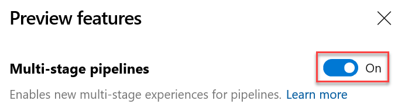

### Retry failed stages

> [!NOTE]
> To try this feature, you must have the preview feature **Multi-stage pipelines** enabled.

One of the most requested features in multi-stage pipelines is the ability to retry a failed stage without having to start from the beginning. With this update, we are adding a big portion of this functionality.

You can now retry a pipeline stage when the execution fails. Any jobs that failed in the first attempt and those that depend transitively on those failed jobs are all re-attempted.

Here are some examples, where this can help you save time. When you run multiple jobs in a stage, and you want each stage to run tests on a different platform. If the tests on one platform fail while others pass, you can save time by not running the jobs that passed. Another example, a deployment stage may have failed due to flaky network connection. Retrying that stage will help you save time by not having to produce another build.

There are a few known gaps in this feature. For example, you cannot retry a stage that you explicitly cancel. We are working to close these gaps in future updates.

### Enhancements to approvals in YAML pipelines

> [!NOTE] 
> You must have **Multi-stage pipelines** and **New service connection experience** preview features enabled to try this feature.

We continue to improve multi-stage YAML pipelines, with this update we enabled configuring approvals on service connections and agent pools.
For approvals we follow segregation of roles between infrastructure owners and developers. By configuring approvals on your resources (environments, service connections, agent pools), you will be assured that all pipeline runs that use resources will first stop and seek approval. 

The experience is similar to how you configure approvals for environments. When an approval is pending on a resource referenced in a stage, the execution of the pipeline waits until the pipeline is manually approved.

> [!div class="mx-imgBorder"]
> 

### Container structure testing support in Azure Pipeline
​
Usage of containers in applications is increasing and thus the need for robust testing and validation. Azure Pipelines now brings supports for **Container Structure Tests**. This framework provides a convenient and powerful way to verify the contents and structure of your containers. 

You can validate the structure of an image based on four categories of tests: command tests, file existence tests, file content tests and metadata tests. You can use the results in the pipeline to make go/no go decisions. Test data is available in the Pipeline run with an error message to help you troubleshoot better. 

Input the config file and image details

> [!div class="mx-imgBorder"]
> 

Test data and summary 

> [!div class="mx-imgBorder"]
> 

### Flaky bug management and resolution

In July, we introduced flaky test management to support end-to-end lifecycle with detection, reporting and resolution. To enhance it further we are adding flaky bug management and resolution. 

While investigating the flaky test you can create a bug using the **Bug** action which can then be assigned to a developer to further investigate the root cause of the flaky test. The bug report includes information about the pipeline like error message, stack trace and other information associated with the test.

When a bug report is resolved or closed, we will automatically unmark the test as unflaky. 

> [!div class="mx-imgBorder"]
> 

### Enhancements to Azure Pipelines app for Slack and Microsoft Teams

**Multi-stage YAML based pipelines**

> [!NOTE]
> To try this feature, you must have the preview feature **Multi-stage pipelines** enabled.

The Azure Pipelines app for Slack and Microsoft Teams now supports multi-stage YAML pipelines for CI and CD. With this enhancement, you will get notified on various events related to YAML pipelines. 

> [!div class="mx-imgBorder"]
> 

Events supported for multi-stage YAML pipelines
* Run state changed
* Run stage state changed
* Run stage waiting for approval
* Run stage approval completed

> [!div class="mx-imgBorder"]
> 

**URL unfurling and messaging extensions**

We've added a [messaging extension](https://docs.microsoft.com/en-us/microsoftteams/platform/concepts/messaging-extensions/messaging-extensions-overview) for the Azure Pipelines app for Microsoft Teams. You can now search for pipelines and share relevant details about the pipeline as a card in the channel. URL unfurling helps you initiate discussions around pipelines and have meaningful & contextual conversations.

> [!div class="mx-imgBorder"]
> 

### Updates to hosted pipelines images

We've updated several of the Azure Pipelines hosted VM images. The following are some the highlights in this update:
* Added Go 1.13 to Ubuntu 16.04, Ubuntu 18.04, VS2017, and VS2019. Go 1.12 remains the default.
* Added Android SDK and Build Tools 29 to Ubuntu 16.04, Ubuntu 18.04, VS2017, and VS2019.
* Added Az Module 2.6.0 to VS2017 and VS2019.
* Various bug fixes.

You can find more details about the latest releases [here](https://github.com/microsoft/azure-pipelines-image-generation/releases).

> [!Note] 
> We will remove Ruby 2.3 from all images in a future update since it [reached end-of-life on March 31, 2019](https://www.ruby-lang.org/en/news/2019/03/31/support-of-ruby-2-3-has-ended/).

### Open Policy Agent installer task

Open Policy Agent is an open source, general-purpose policy engine that enables unified, context-aware policy enforcement. We've added the Open Policy Agent installer task. It is particularly useful for in-pipeline policy enforcement with respect to Infrastructure as Code providers.

For example, Open Policy Agent can evaluate [Rego](https://www.openpolicyagent.org/docs/latest/policy-language/) policy files and Terraform plans in pipeline. 

```
task: OpenPolicyAgentInstaller@0
    inputs:
          opaVersion: '0.13.5'
```

### Pipeline decorators for release pipelines

Pipeline decorators allow for adding steps to the beginning and end of every job. This is different than adding steps to a single definition because it applies to all pipelines in an organization.

We have been supporting decorators for builds and YAML pipelines, with customers using them to centrally control the steps in their jobs. We are now extending the support to release pipelines as well. You can create extensions to add steps targeting the new contribution point and they will be added to all agent jobs in release pipelines.
