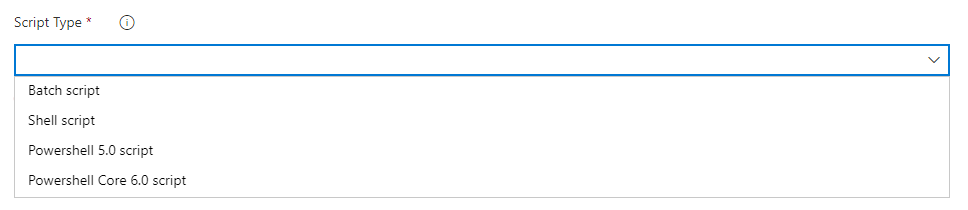

### Deploy Azure Resource Manager (ARM) to subscription and management group level

Previously, we supported deployments only to the Resource Group level. With this update we have added support to deploy ARM templates to both the subscription and management group levels. This will help you when deploying a set of resources together but place them in different resource groups or subscriptions. For example, deploying the backup virtual machine for Azure Site Recovery to a separate resource group and location.

### Updates to hosted pipelines images

We've made updates to several of the Azure Pipelines hosted VM images. The following are some the highlights in this update:

* Upgraded Visual Studio 16.2 to 16.3 for VS2019.
* Upgraded VS for Mac 8.2.6.26 to 8.3.0.1805 for macOS 10.13 and 10.14.
* Added Java 13 to macOS 10.13 and 10.14.
* Added Mono 6.4.0 to  macOS 10.13 and 10.14.
* Upgraded Xcode 11-beta to 11.0 GA.
* Reduced the disk size to increase operational efficiency, resulting in a decrease of approximately 40GB of free space for Ubuntu 16.04.
* Various bug fixes.

You can find more details about the latest releases [here](https://github.com/microsoft/azure-pipelines-image-generation/releases).

> [!Note] 
> We will remove Ruby 2.3 from all images in a future update since it [reached end-of-life on March 31, 2019](https://www.ruby-lang.org/en/news/2019/03/31/support-of-ruby-2-3-has-ended/).

### CD capabilities for your multi-stage YAML pipelines

You can now consume artifacts published by your CI pipeline and enable pipeline completion triggers. In multi-stage YAML pipelines, we are introducing `pipelines` as a resource. In your YAML, you can now refer to another pipeline and also enable CD triggers.

Here is the detailed YAML schema for pipelines resource.

```yaml
resources: 
  pipelines:
  - pipeline: MyAppCI  # identifier for the pipeline resource
        project:  DevOpsProject # project for the build pipeline; optional input for current project
        source: MyCIPipeline  # source pipeline definition name
    branch: releases/M159  # branch to pick the artifact, optional; defaults to all branches
    version: 20190718.2 # pipeline run number to pick artifact; optional; defaults to last successfully completed run
    trigger:     # Optional; Triggers are not enabled by default.
      branches:  
        include:  # branches to consider the trigger events, optional; defaults to all branches.
        - master
        - releases/*
        exclude:   # branches to discard the trigger events, optional; defaults to none.
        - users/*  
```

In addition, you can download the artifacts published by your pipeline resource using the `- download` task.

```yaml
steps: 
- download: MyAppCI  # pipeline resource identifier
    artifact:  A1 # name of the artifact to download; optional; defaults to all artifacts
```

For more details, see the downloading artifacts documentation [here](https://docs.microsoft.com/en-us/azure/devops/pipelines/artifacts/pipeline-artifacts?view=azure-devops&tabs=yaml#downloading-artifacts).

### Bitbucket integration and other improvements in getting started with pipelines

The getting-started wizard experience for Pipelines has been updated to work with Bitbucket repositories. Azure Pipelines will now analyze the contents of your Bitbucket repository and recommend a YAML template to get you going.

A common ask with the getting-started wizard has been the ability to rename the generated file. Currently, it is checked in as `azure-pipelines.yml` at the root of your repository. You can now update this to a different file name or location before saving the pipeline.

Finally, we you will have more control when checking in the `azure-pipelines.yml` file to a different branch since you can choose to skip creating a pull request from that branch.

### Support for PowerShell scripts in Azure CLI task

Previously, you could execute batch and bash scripts as part of an Azure CLI task. With this update, we added support for PowerShell and PowerShell core scripts to the task. 

> [!div class="mx-imgBorder"]
> 