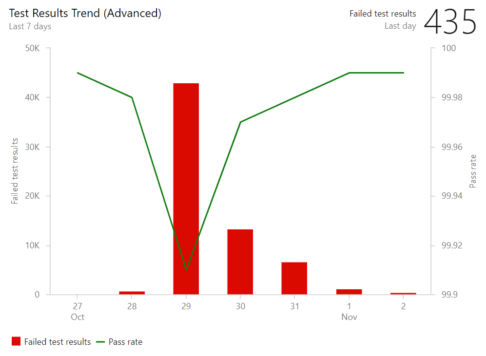

### Test result trend (Advanced) widget

The **Test result trend (Advanced) widget** is now available for those who have installed the [Analytics Extension](https://marketplace.visualstudio.com/items?itemName=ms.vss-analytics) on their Azure DevOps organization. It provides near real-time visibility into your test data for multiple builds and releases. The **Test result trend (Advanced) widget** displays a trend of your test results for your pipelines or across pipelines. You can use it to track the daily count of test, pass rate, and test duration. Tracking test quality over time and improving test collateral is key to maintaining a healthy DevOps pipeline.

> [!div class="mx-imgBorder"]
> 

The **Test result trend (Advanced) widget** helps you find outliers in your test results and answer questions like: are tests taking longer to run than usual? What test file or pipeline is affecting my overall pass rate? What are my long running tests?

To help you answer these questions, the widget provides these features:
* Displays a trend of pass rate, and count of test results or test duration
* Presents test results based on multiple build pipelines or release pipelines
* Uses combined charting options to display two metrics over the same trend
* Filters the test count over time by test outcome
* Filters all your test results by branch or test
* Stacks your metrics by test attributes such as **Priority** or **Environment**
* Group you data on Test files, owner or pipelines

The widget is highly configurable allowing you to use it for a wide variety of scenarios.