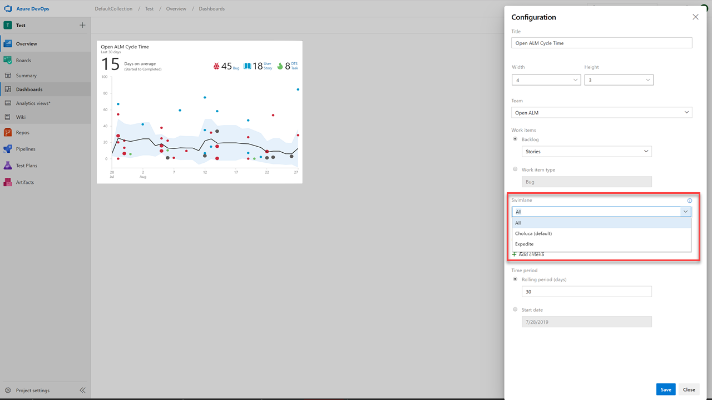
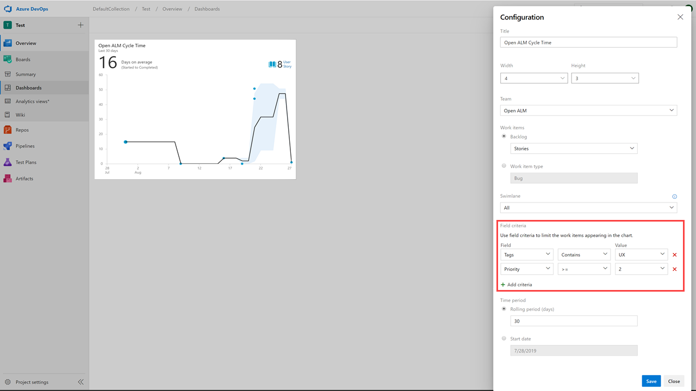

### Lead and Cycle Time widgets advanced filtering

[Lead and cycle time](https://docs.microsoft.com/en-us/azure/devops/report/dashboards/cycle-time-and-lead-time?view=azure-devops) are used by teams to see how long it takes for work to flow through their development pipelines, and ultimately deliver value to their customers. 

Until now, the [lead and cycle time widgets](https://docs.microsoft.com/en-us/azure/devops/report/dashboards/cycle-time-and-lead-time?view=azure-devops#configure-the-cycle-time-and-lead-time-widgets) did not support advanced filter criteria to ask questions such as: "how long is it taking my team to close out the higher priority items?" 

With this update questions like this can be answered by filtering on the Board swimlane. 

> [!div class="mx-imgBorder"]
> 

We've also included work item filters in order to limit the work items that appear in the chart.

> [!div class="mx-imgBorder"]
> 
