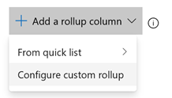
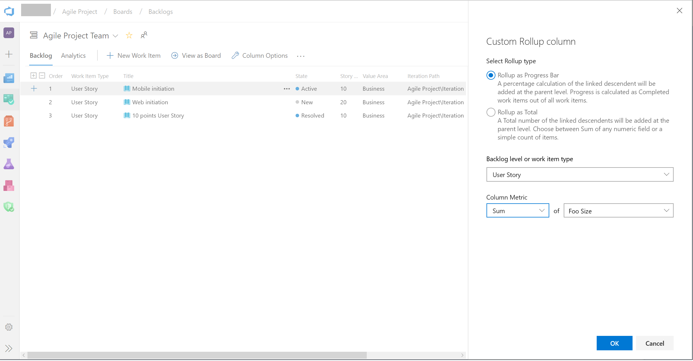

### Support for custom fields in Rollup columns

Rollup can now be done on any field, including custom fields. When adding a Rollup column, you can still pick a Rollup column from the Quick list, however if you want to rollup on numeric fields that are not part of the out of the box process template, you can configure your own as follows:
 
1. On your backlog click "Column options". Then in the panel click "Add Rollup column" and **Configure custom rollup**.
    > [!div class="mx-imgBorder"]
    > 
2. Pick between **Progress Bar** and **Total**.
3. Select a work item type or a Backlog level (usually backlogs aggregate several work item types).
4. Select the aggregation type. **Count of work items** or **Sum**. For Sum you'll need to select the field to summarize.
5. The **OK** button will bring you back to the column options panel where you can reorder your new custom column.

> [!div class="mx-imgBorder"]
> 

Note that you can't edit your custom column after clicking OK. If you need to make a change, remove the custom column and add another one as desired.  

### Inline sprint burndown using story points

Your Sprint Burndown can now burndown by Stories. This addresses your feedback on the[Developer Community](https://developercommunity.visualstudio.com/content/idea/365784/sprint-burndown-using-story-points-effort.html).
  
From the Sprint hub select the Analytics tab. Then configure you report as follows: 

1. Select Stories backlog
2. Select to burndown on **Sum of Story Points**

> [!div class="mx-imgBorder"]
> 