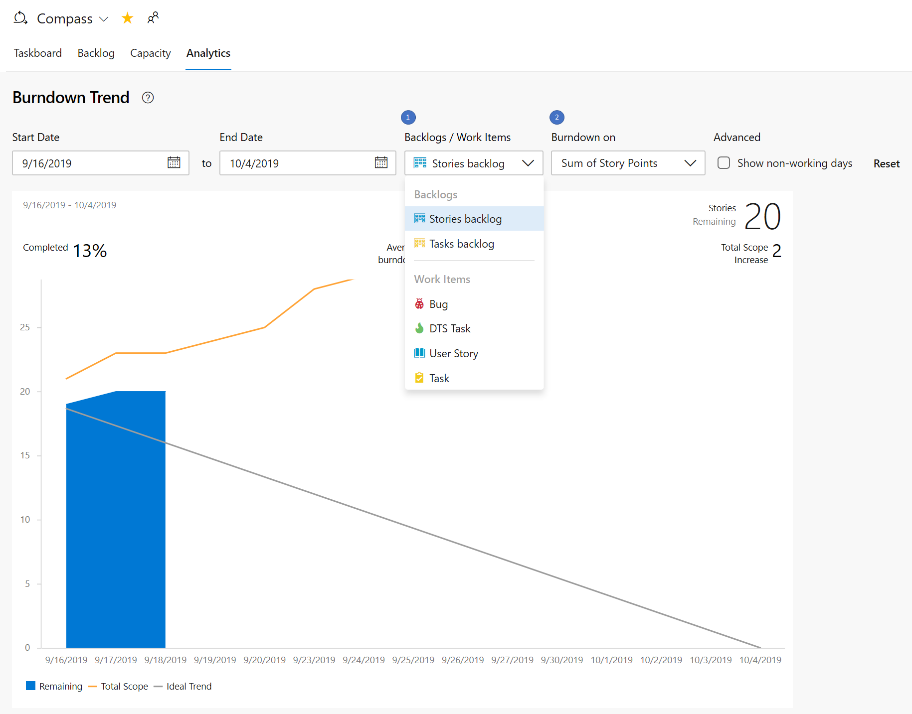

### Support for custom fields in Rollup columns

We are expanding Rollup columns to support custom fields. When adding a Rollup column, you can still pick a Rollup column from the Quick list, however if you want to rollup on numeric fields that are not part of the out of the box process template, you can configure your own as follows : 
1. Pick between Percentage and Total.
2. Select a work item type or a Backlog level (usually backlogs aggregate several work item types). 
3. Select the aggregation type.  Count ot work items or Sum. For Sum you'll need to select the field to summarize.
4. The OK button will bring you back to the column options panel where you can reorder your new custom column.

Note that you can't edit your custom column after clicking OK. If you need to make a change, remove the custom column and add another one as desired.  

### Inline sprint burndown using story points

Based on the feedback you provided in the [Developer Community](https://developercommunity.visualstudio.com/content/idea/365784/sprint-burndown-using-story-points-effort.html), we've updated the sprint **Burndown Trend** report under the sprints **Analytics** tab to burndown using story points.

To configure the report, select the backlog level or the work item type and the metric to burndown on. Your selections will be saved for this sprint and team.

> [!div class="mx-imgBorder"]
> 