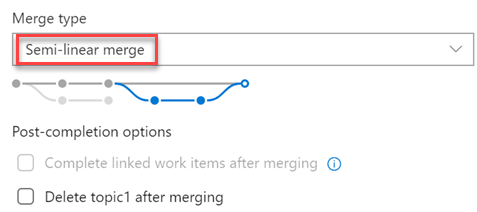

### New merge types for completing pull requests

You now have more options when merging the changes from a pull request to the target branch. We have added support for two of our most requested features on the Developer Community: [Fast-Forward merging](https://developercommunity.visualstudio.com/idea/365639/enable-fastforward-merge-from-pullrequest.html) and [Semi-Linear merging](https://developercommunity.visualstudio.com/idea/365761/add-rebase-and-merge-to-pull-requests.html) (also called “Rebase and Merge”).

You will now see these new options available in the **Complete Pull Request** dialog:

> [!div class="mx-imgBorder"]

The updated policy administration page allows administrators to control which merge strategies are allowed on a branch or folder of branches.

> [!div class="mx-imgBorder"]

> [!NOTE]
> Existing policies are still enforced. For example, if your branch currently has a “squash merge only” policy in place, you will have to edit that policy in order to use the new merge strategies.

There are a few situations when rebasing during pull request completion is not possible:
* If a policy on the target branch prohibits using rebase strategies, you will need “Override branch policies” permission.
* If the source branch of the pull request has policies, you won’t be able to rebase it. Rebasing will modify the source branch without going through the policy approval process.
* If you’ve used the [Merge Conflict Extension](https://nam06.safelinks.protection.outlook.com/?url=https://marketplace.visualstudio.com/items?itemName%3Dms-devlabs.conflicts-tab&data=02%7c01%7cJoe.Bourne%40microsoft.com%7cb19b5f47678043aadffc08d6b126cda9%7c72f988bf86f141af91ab2d7cd011db47%7c1%7c0%7c636891177544782502&sdata=FaoKHy%2BZ5W/YI4rmT7E%2Bn22Kato/wrE18%2B3lWXPq778%3D&reserved=0) to resolve merge conflicts. Conflict resolutions applied to a three-way merge are seldom successful (or even valid) when rebasing all the commits in a pull request one at a time.

In all these cases, you still have the option of rebasing your branch locally and pushing to the server, or squash-merging your changes when completing the pull request.
