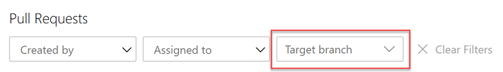
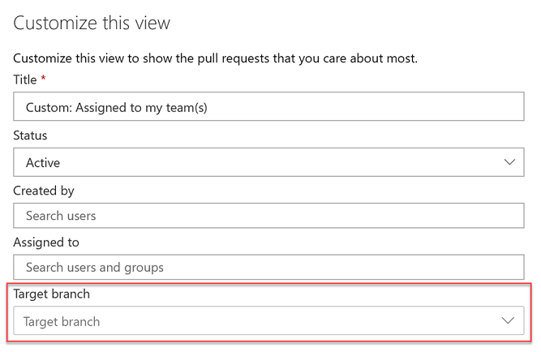

### Filter by target branch in pull requests (PRs)

Pull requests let your team review code and give feedback on changes before merging them into the master branch. They have become an important part of many teams’ workflows since you can step through proposed changes, leave comments, and vote to approve or reject code changes.

To make it easier for you to find your pull requests, we added a filtering option to let you search for PRs using the target branch. 

> [!div class="mx-imgBorder"]
> 

You can also use the target branch filtering to customize the pull requests view in the **Mine** tab.

> [!div class="mx-imgBorder"]
> 

### Allow extensions to add syntax highlighting and autocomplete

Currently, we publish syntax highlighting for a subset of languages supported by the [Monaco editor](https://github.com/Microsoft/monaco-languages). However, many of you want to create your own syntax highlighting for languages that we don’t support.

With this update, we added an extensibility point that allows extensions to add syntax highlighting and autocomplete to the file explorer and pull requests views.

You can find an example of an extension demonstrating this feature [here](https://github.com/Microsoft/azure-devops-extension-sample/tree/master/src/Samples/CodeEditorContribution).

In addition, we added support for [Kusto language](https://docs.microsoft.com/azure/kusto/query/) syntax highlighting.

### Manage git references from the command line

With the Azure Repos `ref command`, you can now create, list, delete references (branch/tag) and also lock or unlock a branch reference.  This makes it easier to tag a commit ID without having to checkout the whole repository when working with Azure Repos from the command line. 

For more details on the commands and its syntax, see the documentation [here](https://docs.microsoft.com/cli/azure/ext/azure-devops/repos/ref?view=azure-cli-latest).

### Update repository name and default branch from the command line

Now you can update the repository name as well as the default branch of a repository using the Azure Repos update command. For example, if you wanted to update the name of the Service repository to ContosoService and set the default branch to development, you could run this command: `az repos update --repository "Service" --name "ContosoService" --default-branch "development"`

For more details see the documentation [here](https://docs.microsoft.com/cli/azure/ext/azure-devops/repos?view=azure-cli-latest#ext-azure-devops-az-repos-update).
