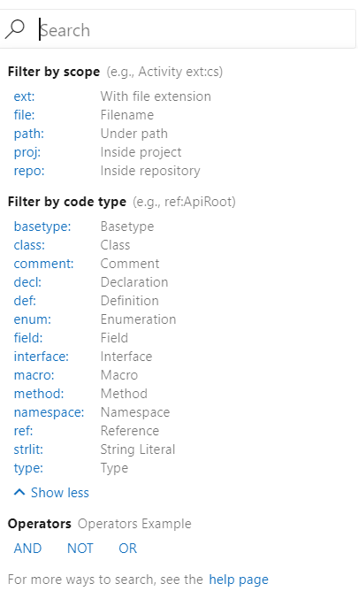
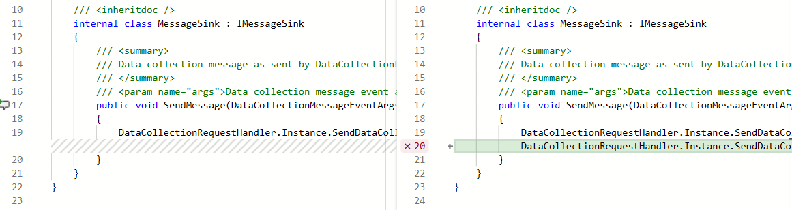
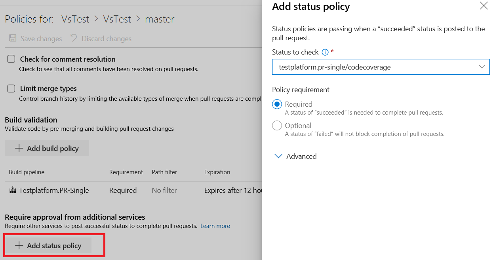
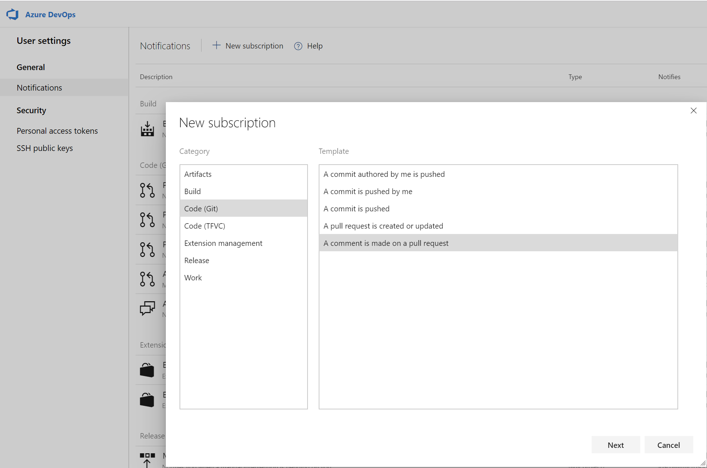
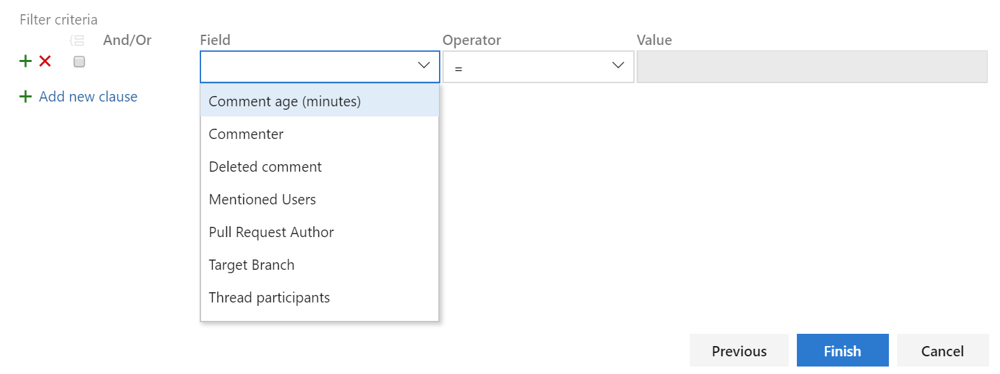
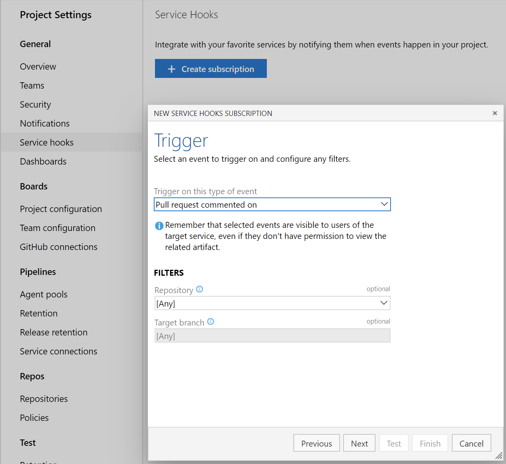

### Improved code search filtering options

Previously, code search supported 39 code search filters such as **comment:** and **def:**. Data suggested that there were many filters not being used, therefore we are removing a few filters and merging others. With this update we reduced the number of filters to 19. This will help by making code search queries more efficient and reduce clutter in the interface. 

> [!div class="mx-imgBorder"]
> 

For example, now **func:** maps to **method:**, i.e. if you search for **func:AccountAdmin**, the results will be mapped to **method:AccountAdmin**. Similarly **macrodef:** and **macroref:** are mapped to **macro:**. On the other hand, filters such as **union:** and **org:** have been deprecated due to lack of use.

### Code coverage metrics and branch policy for pull requests

You can now see code coverage metrics for changes within the pull request (PR) view. This ensures that you have adequately tested your changes through automated tests. 
Coverage status will appear as a comment in the PR overview. You can view details of coverage information for every code line that is changed in the file diff view.

> [!div class="mx-imgBorder"]
> 

> [!div class="mx-imgBorder"]
> 

Additionally, repo owners can now set code coverage policies and prevent large, untested changes from being merged into a branch. Desired coverage thresholds can be defined in an `azurepipelines-coverage.yml` settings file that is checked in at the root of the repo and coverage policy can be defined using the existing [configure a branch policy for additional services](https://docs.microsoft.com/en-us/azure/devops/repos/git/pr-status-policy?view=azure-devops) capability in Azure Repos.

> [!div class="mx-imgBorder"]
> 

### Filter comment notifications from pull requests

Comments in pull requests can often generate a lot of noise due to notifications. We've added a custom subscription that allows you to filter which comment notifications you subscribe to by comment age, commenter, deleted comment, mentioned users, pull request author, target branch and thread participants. You can create these notification subscriptions by clicking the user icon on the top right corner and navigating to **User settings**.

> [!div class="mx-imgBorder"]
> 

> [!div class="mx-imgBorder"]
> 

### Service hooks for pull request comments

You can now create service hooks for comments in a pull request based on repository and target branch.

> [!div class="mx-imgBorder"]
> 