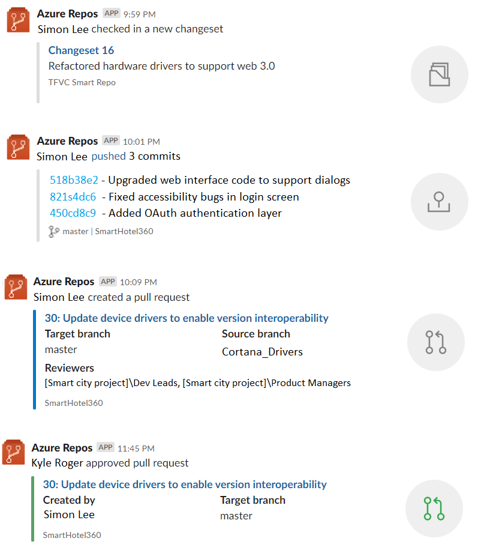

### Azure Repos app for Slack

We are excited to announce the new Azure Repos app for Slack. With this app, you can monitor your repositories and get notified whenever code is pushed/checked in, pull requests (PR) are created, PRs are updated and much more in your Slack channel. In addition, previews for pull request URLs will help you to initiate discussions around PRs and have contextual and meaningful conversations. The app supports both Git and TFVC repositories.

> [!div class="mx-imgBorder"]
> 
