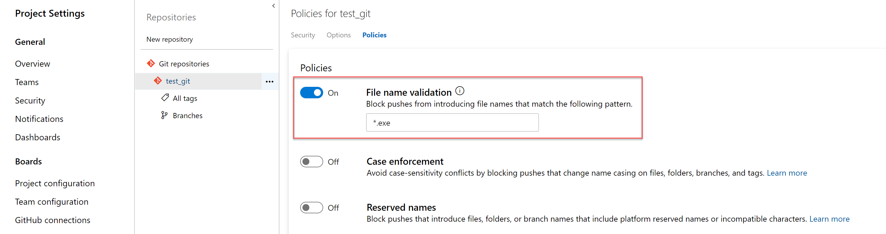
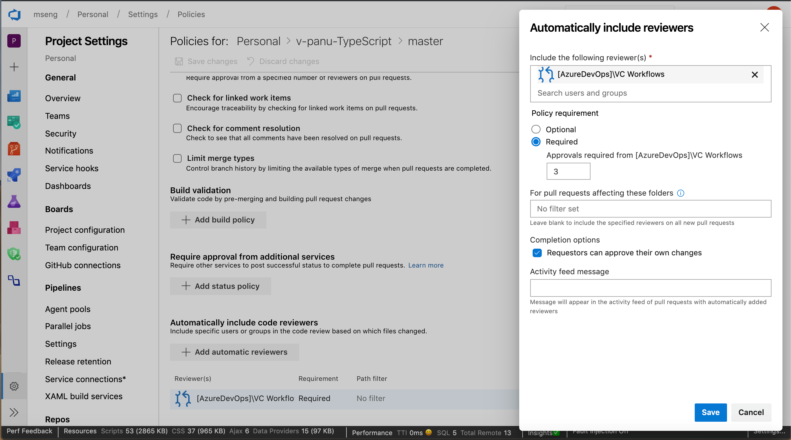

### Policy to block files with specified patterns 
 
Administrators can now set a policy to prevent commits from being pushed to a repository based on file types and paths. The file name validation policy will block pushes that match the provided pattern. 

> [!div class="mx-imgBorder"]
> 

### Resolve work items via commits using key words

You can now resolve work items via commits made to the default branch by using key words like **fix**, **fixes**, or **fixed**. For example, you can write - "this change fixed #476" in your commit message and work item #476 will be completed when the commit is pushed or merged into the default branch. 
For more details see the documentation [here](https://docs.microsoft.com/en-us/azure/devops/repos/git/resolution-mentions).

### Granularity for automatic reviewers 

Previously, when adding group level reviewers to a pull request, only one approval was required from the group that was added. Now you can set policies that require more than one reviewer from a team to approve a pull request when adding automatic reviewers. In addition, you can add a policy to prevent requestors approving their own changes. 

> [!div class="mx-imgBorder"]
> 