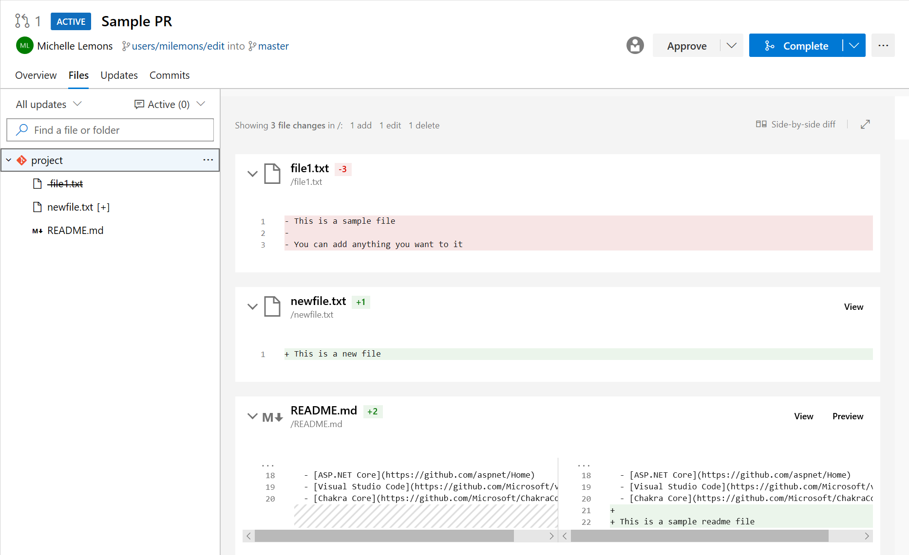

### Use service account based authentication to connect to AKS

Previously, when configuring Azure Pipelines from the AKS Deployment Center, we were using Azure Resource Manager Connection. This connection had access to the entire cluster and not the namespace for which the pipeline was configured.  With this update, we've moved our pipelines to start using service account based authentication to connect to the cluster which will have access only to the namespace.

### Preview Markdown files in pull request Side-by-side diff 

You can now see a preview of how a markdown file will look like by using the new **Preview** button. In addition, you can see the full content of a file from the Side-by-side diff by selecting the **View** button. 

> [!div class="mx-imgBorder"]
> 