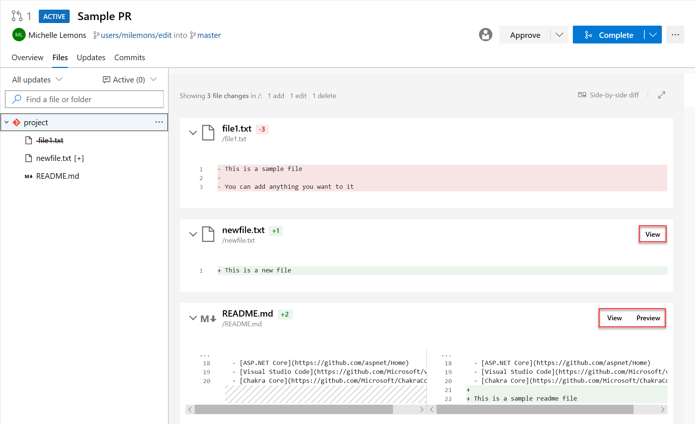

### Use service account-based authentication to connect to AKS

Previously, when configuring Azure Pipelines from the AKS Deployment Center, we used Azure Resource Manager Connection. This connection had access to the entire cluster and not the namespace for which the pipeline was configured.  With this update, we've moved our pipelines to start using service account-based authentication to connect to the cluster which will have access only to the namespace.

### Preview Markdown files in pull request Side-by-side diff 

You can now see a preview of how a markdown file will look by using the new **Preview** button. In addition, you can see the full content of a file from the Side-by-side diff by selecting the **View** button. 

> [!div class="mx-imgBorder"]
> 

### Build policy expiration for manual builds

Branch policies help protect your development branches. Policies enforce your team's code quality and change management standards. Previously, you could set build expiration polices for automated builds. Now you can set build expiration policies to your manual builds as well. 

> [!div class="mx-imgBorder"]
> 

### Add a policy to block commits based on the commit author email

Administrators can now set a push policy to prevent commits from being pushed to a repository for which the commit author email does not match the provided pattern.

> [!div class="mx-imgBorder"]
> 