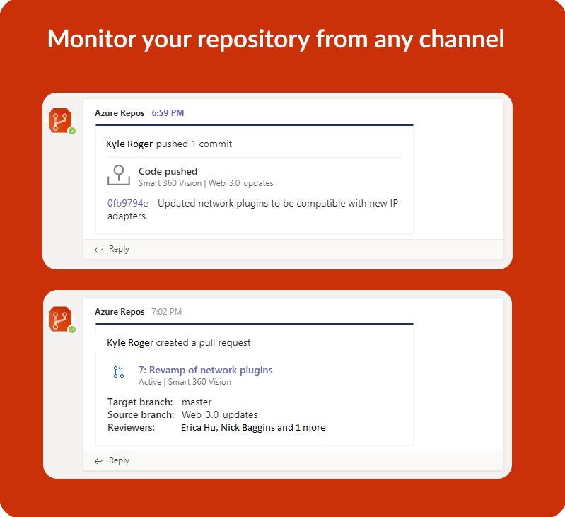
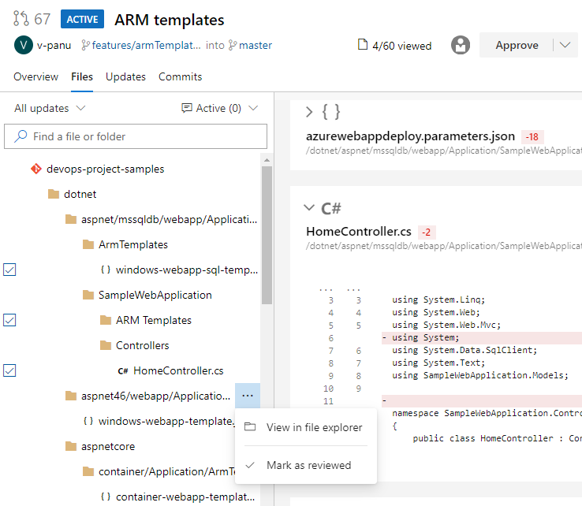
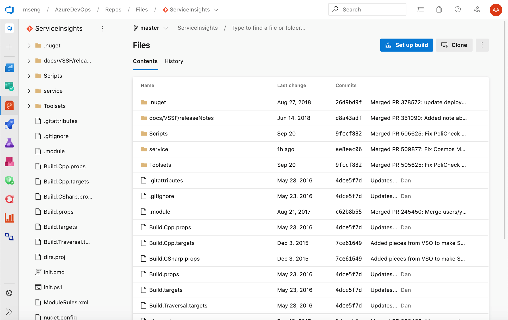
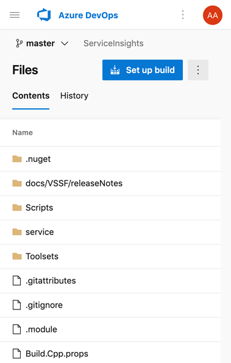

### Azure Repos app for Microsoft Teams

We are excited to announce the new Azure Repos app for Microsoft Teams. With this app, you can monitor your repositories and get notified whenever code is pushed/checked in, pull requests (PR) are created or updated and much more in your Teams channel. In addition, previews for pull request URLs will help you to initiate discussions around PRs and have contextual and meaningful conversations. The app supports both Git and TFVC repositories.

> [!div class="mx-imgBorder"]
> 

### Mark files as reviewed in a pull request

Sometimes, you need to review pull requests that contain changes to a large number of files and it can be difficult to keep track of which files you have already reviewed. Now you can mark files as reviewed in a pull request. 

You can mark a file as reviewed by using the drop-down menu next to a file name or by hover and clicking on the file name. 

> [!Note] 
> This feature is only meant to track your progress as you review a pull request. It does not represent voting on pull requests so these marks will only be visible to the reviewer.

> [!div class="mx-imgBorder"]
> 

This feature was prioritized based on a suggestion from the [Developer Community](https://developercommunity.visualstudio.com/content/idea/365746/add-a-checkbox-in-pull-request-file-list-for-each.html).

### New Web UI for Azure Repos landing pages (preview)

You can now try out our new modern, fast, and mobile-friendly landing pages within Azure Repos. These pages are available to preview as **New Repos landing pages**.  Landing pages include all pages except for pull request details, commit details and branch compare. 

Web

> [!div class="mx-imgBorder"]
> 

Mobile

> [!div class="mx-imgBorder"]
> 

### Proximity support for code search

As we listened to your feedback from the [Developer Community]((https://developercommunity.visualstudio.com/idea/474980/support-of-proximity-search-terms-near-before-afte.html)), we heard that you wanted the ability to search your code to find files with terms in close proximity to one another. You can now use **NEAR**, **BEFORE** and **AFTER** operators to find files based on the term distance and ordering. For example, if you search for *foo NEAR bar* it will return all files where *foo* is in proximity to the term *bar*. 

To learn more about code search, see the documentation [here](https://docs.microsoft.com/en-us/azure/devops/project/search/advanced-code-search-syntax?view=azure-devops#search-for-special-characters).
