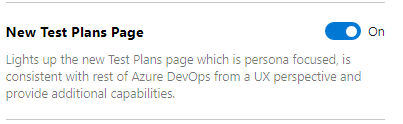

### New Test Plan page public preview
 
A new Test Plans Page (**Test Plans***) is available in public preview to all Azure DevOps organizations. The new page provides streamlined views to help you focus on the task at hand - test planning, authoring or execution. It is also clutter-free and consistent with the rest of the Azure DevOps offering.

> [!div class="mx-imgBorder"]
> 

The new page can enable from Preview Features as shown below. 

> [!div class="mx-imgBorder"]
> 

The Test Plans* page will have most of the capabilities from the existing page in addition to new features such as **copy and clone test plans**. We will continue to add test planning and authoring capabilities every 3 weeks.

> [!div class="mx-imgBorder"]
> 

To learn more about the new page see the documentation [here](https://docs.microsoft.com/en-us/azure/devops/test/new-test-plans-page?view=azure-devops).