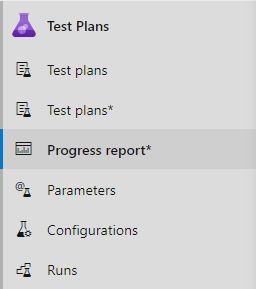
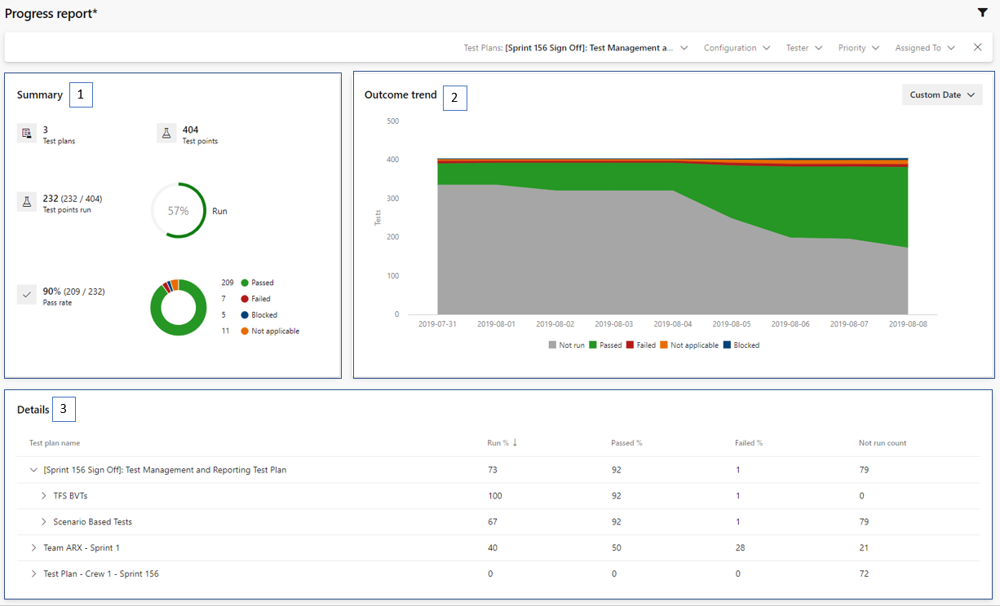
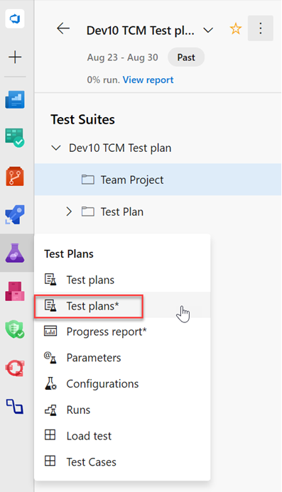
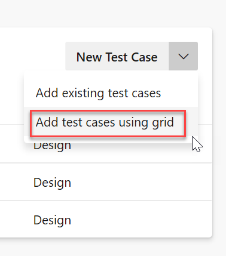
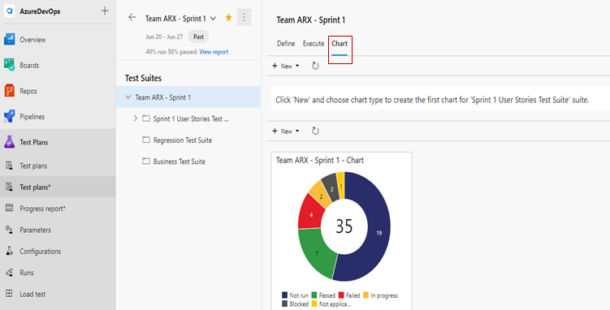
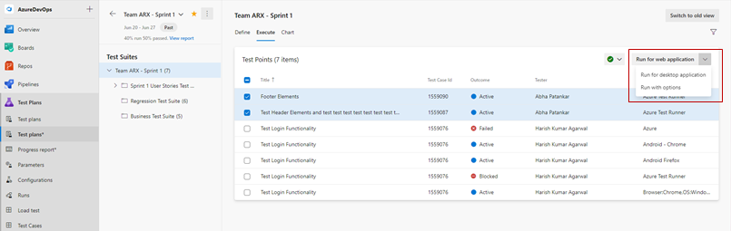

### Test Plans Progress report (public preview)
 
Progress report for Test Plans is now available in public preview. This out-of-the-box report helps you track the execution and status of one or more Test Plans in a project. Visit Test Plans > Progress report* to start using the report. 

> [!div class="mx-imgBorder"]
> 
 
The three sections of the report include the following:  
1. **Summary**: shows a consolidated view for the selected test plans. 
2. **Outcome trend**: renders a daily snapshot to give you an execution and status trendline. It can show data for 14 days (default), 30 days, or a custom range. 
3. **Details**: this section lets you drill down by each test plan and gives you important analytics for each test suite. 
 
> [!div class="mx-imgBorder"]
> 

### Enhancements to Test Plans page

You can now add test cases in bulk using the new Test Plans* page grid. The grid has six columns for bulk authoring in contrast to the three columns in the previous view. You can start using grid by navigating to Test Plans* > Add Test Cases > **Add Test Cases Using Grid**.

> [!div class="mx-imgBorder"]
> 

> [!div class="mx-imgBorder"]
> 

In addition, we added **Chart** to the Test Plans* page. You can find the Chart tab by navigating to **Test Plans* > Chart**.

> [!div class="mx-imgBorder"]
> 

Finally, you can now sort the columns in the Define and Execute tabs. You can also adjust the width of the columns to see large titles and run test cases with options from the **Execute** tab. 

> [!div class="mx-imgBorder"]
> 
