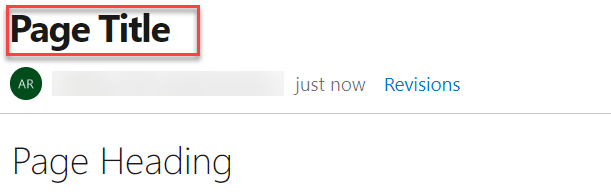

### Monospaced font for Wiki Markdown editor

With the introduction of monospaced fonts for wiki Markdown editor, readability is no longer a challenge. The Markdown source looks clean and easy to read. This feature has been prioritized based on [this suggestion ticket](https://developercommunity.visualstudio.com/content/idea/365936/tfs-wiki-editor-monospaced-font.html).

> [!div class="mx-imgBorder"]

### Bold Wiki page titles

Earlier, both the Wiki page title and Header 1 looked the same. This made it difficult for readers to differentiate between them. Now, the Wiki page titles have been made bold and distinct from Header 1.
This feature has been prioritized based on [this suggestion ticket](https://developercommunity.visualstudio.com/content/idea/366271/make-styling-of-wiki-page-title-different-from-h1.html).

> [!div class="mx-imgBorder"]

### Insert Markdown table

Creating Markdown tables in a wiki is no longer a challenge. You can now add a Markdown table with a click of a button. This feature has been prioritized based on [this feature suggestion ticket](https://developercommunity.visualstudio.com/content/idea/365879/include-table-support-in-the-wiki-wysiwyg-editor.html).

> [!div class="mx-imgBorder"]

### Embed Azure Boards query results in Wiki

You can now embed Azure Boards query results in a wiki page in the form of a table.
The image below shows a sample of a wiki page with a list of all features released and all the active bugs in the current sprint embedded in the wiki. The content displayed in the page is using an existing work item query. With this new feature you can create dynamic content and not need to worry about manually updating the wiki page.

> [!div class="mx-imgBorder"]

The query results can be added in two steps

1. Click on the "Query Results" button from the edit toolbar.

> [!div class="mx-imgBorder"]

2. Select the required query and click on "Insert" button.

The results of the query can now be viewed in the form of a table after you save the page.

> [!div class="mx-imgBorder"]

This has been prioritized based on the following features suggestions:

1. [Work Item Queries in Wiki](https://developercommunity.visualstudio.com/content/idea/365790/work-item-queries-in-wiki.html)
2. [Add Dynamic Wiki Content](https://developercommunity.visualstudio.com/content/idea/379611/add-dynamic-wiki-content.html)