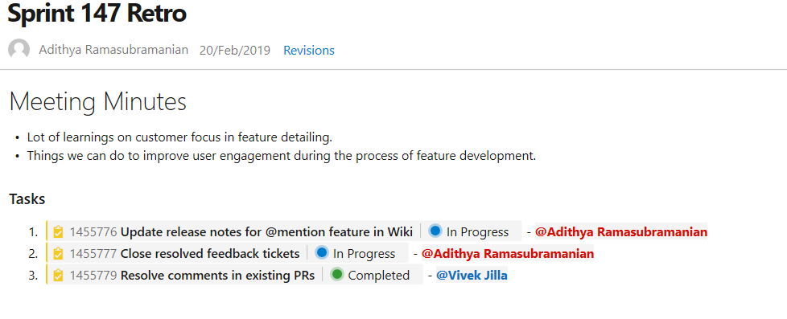

### @mention users and groups

You can now @mention users and groups in a wiki page. This makes documents like a team's contact page, guidance documents and knowledge documents richer. The image below is an example showing a sprint retrospective with tasks and the person responsible.

> [!div class="mx-imgBorder"]

In addition, you can also select a user or a group from the autosuggestion by typing "@" in the wiki edit page. The person mentioned will also get notified by mail.

> [!div class="mx-imgBorder"]

Finally, you can also click on the @mentioned user to view the profile information card.
This feature has been prioritized based on [this](https://developercommunity.visualstudio.com/content/idea/365698/wiki-mention.html) feature suggestion.