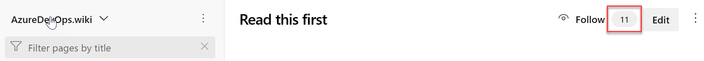

### New modern user experience

Wiki has a new look and performance has been improved. For instance, the page navigation tree has been moved to the left to provide a natural data flow from left to right. Also, until now, the amount of vertical space was constrained by the header. With this update, we made the page scroll fully so that you get a lot more vertical space for your content.  

> [!TIP]
> You can quickly navigate to the edit page by pressing **e** on your keyboard.

We also made the following changes to the menu items:

1. The menu actions have been consolidated into the following three categories: 

    * Wiki level actions are next to the wiki picker

        > [!div class="mx-imgBorder"]
        >

    * Tree level actions

        > [!div class="mx-imgBorder"]
        >

    * Page level actions

        > [!div class="mx-imgBorder"]
        >

2. The **New page** button has been moved into the tree. You can also press **n** on the keyboard to create a new page.

    > [!div class="mx-imgBorder"]
    >

3. We have also added **count** to the **Follow** functionality to tell you how many people are following a page. This can give you an idea of how important a page is.

    > [!div class="mx-imgBorder"]
    >

### Support for HTML tags

Now, you can create richer content in wiki using HTML tags. Check out what you can do with HTML tags below.  

1. You can now create collapsible sections inside your wiki pages by using the **details** and **summary** tags. You can add the **open** attribute  to keep the details expanded by default.

    > [!div class="mx-imgBorder"]
    > 

    For more information on the **details** tag, take a look at the documentation [here](https://www.w3schools.com/tags/tag_details.asp). 

    This was prioritized based on [this suggestion ticket](https://developercommunity.visualstudio.com/content/idea/365782/wiki-collapsible-sections.html).

  > [!NOTE]
  > This tag is not supported in Edge and Internet Explorer browsers.

2. In addition, you can add a caption to your images using the **figure** and **figcaption** tags. These tags let you add alternate text for images and create associated image blocks. The **figcaption** tag can be added above or below the image.

  > [!div class="mx-imgBorder"]
  >

    For more information on the **figcaption** tag, see the documentation [here](https://www.w3schools.com/tags/tag_figcaption.asp)

3. Finally, you can highlight parts of text in your wiki pages by using the **mark** tag. This lets you highlight important text in your wiki pages to draw readers attention.

    > [!div class="mx-imgBorder"]
    > 

    For more information about the **mark** tag, see the documentation [here](https://www.w3schools.com/tags/tag_mark.asp). 

### Improved table creation and editing

Until now, creating and editing tables in a wiki was difficult. We've made changes to make it easier for you to add and manage tables in your wiki. 

1. Create a table from grid

    You no longer have to remember the markdown table syntax. Now you can create a markdown table easily by selecting from a 15 X 15 grid. Just select the required number of columns and rows to insert a table with a single click.

  > [!div class="mx-imgBorder"]
  > 

    This feature has been prioritized based on the following suggestion tickets:

  * [Table view for wiki](https://developercommunity.visualstudio.com/content/idea/365781/table-view-for-wiki.html)
  * [Make it simple to insert tables in wiki](https://developercommunity.visualstudio.com/content/idea/366218/make-it-simple-to-insert-tables-in-wiki-it-is-ridi-1.html)

2. Better table readability

    You can now toggle **word wrap** for your editor to have better readability of your tables. Disabling word wrap adds a scroll bar which lets you see the content of large tables easier.

  > [!div class="mx-imgBorder"]
  > 

3. Autoformating markdown tables

    You no longer have to add spaces to align your markdown columns. With the **Format tables** button, your markdown tables are automatically formatted by adding spaces to the cells to align the columns. If you have large tables, use it with **disable word wrap** to make the tables easier to read.​

  > [!div class="mx-imgBorder"]
  > 

    You can also use the **Ctrl + Shift + F** shortcut to format your tables.
