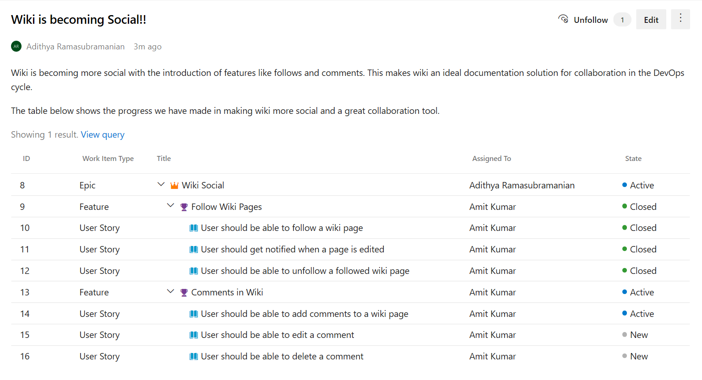

### Support for queries with tree of work items

Now, you can use queries that group work items into a hierarchy in a wiki page. You can embed queries with a tree of work items in a wiki page to show Epics and Features along with the child Tasks and User Stories.

> [!div class="mx-imgBorder"]
> 