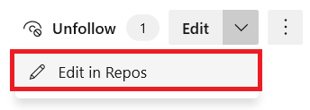

### Rich editing for code wiki pages

Previously, when editing a code wiki page, you were redirected to the Azure Repos hub for editing. Currently, the Repo hub is not optimized for markdown editing. 

Now you can edit a code wiki page in the side-by-side editor inside wiki. This lets you use the rich markdown toolbar to create your content making the editing experience identical to the one in project wiki. You can still choose to edit in repos by selecting the **Edit in Repos** option in the context menu.

> [!div class="mx-imgBorder"]
> 

### Create and embed work items from a wiki page

As we listened to your feedback, we heard that you use wiki to capture brainstorming documents, planning documents, ideas on features, spec documents, minutes of meeting. Now you can easily create features and user stories directly from a planning document without leaving the wiki page. 

To create a work item select the text in the wiki page where you want to embed the work item and select **New work item**. This saves you time since you don't have to create the work item first, go to edit and then find the work item to embed it. It also reduces context switch as you don’t go out of the wiki scope.

> [!div class="mx-imgBorder"]
> 

To learn more about creating and embeding a work item from wiki, see our documentation [here](https://docs.microsoft.com/en-us/azure/devops/project/wiki/create-embed-wit-from-wiki?view=azure-devops).