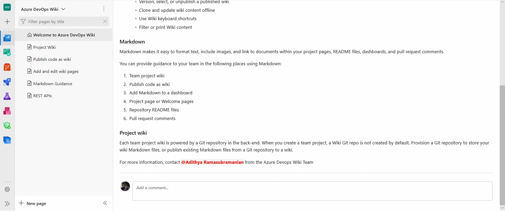

### Comments in wiki pages

Previously, you didn't have a way to interact with other wiki users inside the wiki. This made collaborating on content and getting questions answered a challenge since conversations had to happen over mail or chat channels. With comments, you can now collaborate with others directly within the wiki. You can leverage the @mention users functionality inside comments to draw the attention of other team members. This feature was prioritized based on [this suggestion ticket](https://developercommunity.visualstudio.com/content/idea/379601/ability-to-comment-wiki-content-like-in-pull-reque.html). For more on comments, please see our documentation [here](https://docs.microsoft.com/en-us/azure/devops/project/wiki/add-comments-wiki?view=azure-devops).

> [!div class="mx-imgBorder"]
> 

### Hide folders and files starting with “.” in wiki tree

Until now, the wiki tree showed all the folders and files starting with a dot (.) in the wiki tree. In code wiki scenarios, this caused folders like .vscode, which are meant to be hidden, to show up in the wiki tree. Now, all the files and folders starting with a dot will remain hidden in the wiki tree hence reducing unnecessary clutter.

This feature was prioritized based on [this suggestion ticket](https://developercommunity.visualstudio.com/content/idea/366488/hide-folders-in-wiki-like-pages.html).