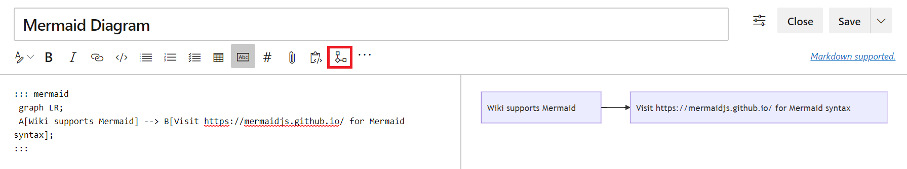

### Short and readable Wiki page URLs

You no longer have to use a multiline URL to share wiki page links. We are leveraging the page IDs in the URL to remove parameters hence making the URL shorter and easier to read.

The new structure of URLs will look like:

```
https://dev.azure.com/{accountName}/{projectName}/_wiki/wikis/{wikiName}/{pageId}/{readableWiki PageName}
```
This is an example of the new URL for a **Welcome to Azure DevOps Wiki** page:

```
https://dev.azure.com/microsoft/ AzureDevOps/_wiki/wikis/AzureDevOps.wiki/1/Welcome-to-Azure-DevOps-Wiki
```

This was prioritized based on this [feature suggestion ticket](https://developercommunity.visualstudio.com/content/idea/365794/make-urls-human-readable.html) from the Developer Community.

### Mermaid diagram support in wiki

We've added support for inserting [mermaid diagrams](https://mermaidjs.github.io/#/README) in wiki pages. You can now create, edit and manage flow charts, sequence diagrams in your design documents and add Gantt charts in your planning documents in Azure DevOps Wiki.

> [!div class="mx-imgBorder"]
> 

This was prioritized based on this [feature suggestion ticket](https://developercommunity.visualstudio.com/content/idea/365751/wiki-mermaid-plantuml-support.html) from the Developer Community. For more information about Mermaid diagrams, see our documentation [here](https://docs.microsoft.com/en-us/azure/devops/project/wiki/wiki-markdown-guidance?view=azure-devops#add-mermaid-diagrams-to-a-wiki-page).
