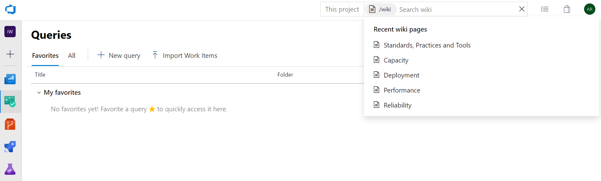

### Search for wiki pages across organizations
 
You can now search for wiki pages across organizations, without navigating to a different organization, using the **Search within** drop-down on wiki search. The **Search within** drop-down provides a list of all organizations you have access to with the number of hits per organization for the search term. You can use this to navigate through search results from different organization quickly and easily. 

> [!div class="mx-imgBorder"]
> 

### Access recently visited wiki pages

We've made it easy for you to find recently visited wiki pages in the project. You can now access recently visited wiki pages by clicking on the search box in Wiki hub.

> [!Tip] 
> You can invoke the search box by typing the keyboard shortcut "/".

> [!div class="mx-imgBorder"]
> 

### Instant search for wiki

Now, you can view the wiki search results as you type in the search box. This will help you quickly navigate to the wiki page of your choice.

> [!div class="mx-imgBorder"]
> 

You can also search for your wiki pages from Azure Boards by typing **/wiki**.

> [!div class="mx-imgBorder"]
> 