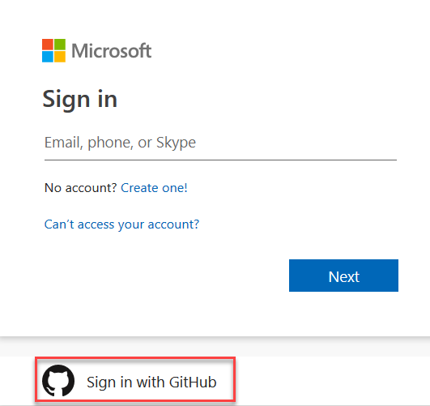

# Kubernetes integration with Azure Pipelines - Microsoft Build Announcements

The [Microsoft Build](https://www.microsoft.com/en-us/build) conference was held on May 6 - 8 in Seattle.  During the conference we announced several exciting new features. 

For instance, you can now use GitHub identity to login into the Azure DevOps portal. In addition, you can take your GitHub repo all the way to Kubernetes using a YAML based multistage pipeline. 

Check out the [Features](#features) list below for more.

## Features

General:

- [Signing into Azure DevOps using your GitHub credentials](#signing-into-azure-devops-using-your-github-credentials)

Azure Pipelines:

- [Kubernetes integration for Azure Pipelines](#kubernetes-integration-for-azure-pipelines)
- [Multi-stage YAML pipelines](#multi-stage-yaml-pipelines)

Azure Artifacts:

- [Pay-per-GB](#pay-per-gb)
- [General availability of Python and Universal Packages](#general-availability-of-python-and-universal-packages)

Administration:

- [A simpler way to buy Azure DevOps](#a-simpler-way-to-buy-azure-devops)

## General

### Signing into Azure DevOps using your GitHub credentials

Now you can use your GitHub credentials to sign in to Azure DevOps. You will see the option to sign in with your GitHub account on all Microsoft log in pages. To use your GitHub credentials, click on **Sign in with GitHub**.

> [!div class="mx-imgBorder"]

After signing into GitHub and authorizing the Microsoft application, you will get a new Microsoft account that is linked to your GitHub identity. During this process, you also have the opportunity to link it to an existing Microsoft account if you like.

You can see the blog post with the full announcement [here](https://devblogs.microsoft.com/devops/signing-into-azure-devops-using-your-github-credentials/)

## Azure Pipelines

### Kubernetes integration for Azure Pipelines

Kubernetes and Docker containers have become an important part of many organizations’ technology stack. Kubernetes allows you to increase the agility of your infrastructure when running your apps at scale. Combining containers with DevOps practices can make the development process much more agile through continuous integration and continuous delivery practices built around containers.

To help you move forward with containers, we've made it easy to get started in Azure Pipelines so you can build applications with Docker containers and deploy them to Kubernetes clusters, in any cloud. We have also added a dedicated Kubernetes Environments view in Azure Pipelines. 

You can see the details on new features and the full announcement [here](https://devblogs.microsoft.com/devops/announcing-kubernetes-integration-for-azure-pipelines/). 

### Multi-stage YAML pipelines

We now offer a unified YAML experience so you can configure your pipelines to utilize both continuous integration (CI) and continuous delivery (CD). Defining your pipelines using YAML documents allows you to check the pipeline configuration into source control along with your application’s code, for easy management, versioning, and control.

With the new YAML support, we’re also adding a new UI to help you visualize all multi-stage pipelines across the product. In addition, we have a new log viewing experience that lets you easily jump between stages and jobs along with helping you quickly identify errors and warnings. 

Finally, we have also added the concept of Environments to help diagnose deployment failures, improve traceability and track multiple deployments.

To enable these features, go to the preview features page and turn on **Multi-stage pipelines**.

For more details about these features you can see the full announcement [here](https://devblogs.microsoft.com/devops/whats-new-with-azure-pipelines/).

## Azure Artifacts

### Pay-per-GB

Until now, a separate, additional license was required for anyone using Azure Artifacts, beyond the Azure DevOps basic license. We heard your feedback that this was inflexible, hard to manage, and often not cost-effective. Based on this feedback, we've changed how we charge for Azure Artifacts. Now, we will only charge for the storage you use, not the number of people who use it. This way every user in your organization can access and share packages.

Every organization can use up to 2 GB storage for free. Additional storage usage is charged according to tiered rates starting at $2 per GB and decreasing to $0.25 per GB. Full details can be found on [our pricing page](https://azure.microsoft.com/en-us/pricing/details/devops/).

### General availability of Python and Universal Packages

We've had support for [Python packages](https://docs.microsoft.com/en-us/azure/devops/artifacts/quickstarts/python-packages), as well as our own [Universal Packages](https://docs.microsoft.com/en-us/azure/devops/artifacts/quickstarts/universal-packages), in public preview for some time. Starting now, both are generally available and ready for all your production workloads.

You can see the blog post on pay-per-GB pricing and other Azure Artifacts updates [here](https://devblogs.microsoft.com/devops/pay-per-gb-azure-artifacts/).

## Administration

### A simpler way to buy Azure DevOps

We are constantly working to improve our end-to-end experience, including how you purchase our product. In response to your feedback, we are pleased to announce changes that will simplify how you purchase some of Azure DevOps services. We’ll be rolling out the Azure Artifacts changes on May 6, 2019 and the other licensing changes will be reflected on your bill from June 1, 2019 on.

Take a look at the blog post with the full announcement [here](https://devblogs.microsoft.com/devops/a-simpler-way-to-buy-azure-devops/). 

## Next steps

Head over to Azure DevOps and take a look.

> [!div class="nextstepaction"]
> [Go to Azure DevOps](http://go.microsoft.com/fwlink/?LinkId=307137&campaign=o~msft~docs~product-vsts~release-notes)

## Feedback

We would love to hear what you think about these features. Use the feedback menu to report a problem or provide a suggestion.

> [!div class="mx-imgBorder"]

You can also get advice and your questions answered by the community on [Stack Overflow](https://stackoverflow.com/questions/tagged/azure-devops).

Thanks,

Gopinath Chigakkagari ([Twitter](https://twitter.com/gopinach))
